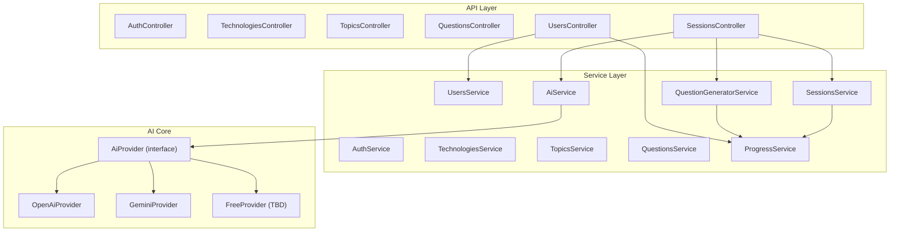
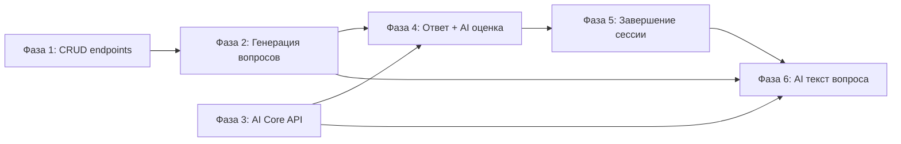

# Backend Development Roadmap — onBoard

## Текущее состояние

**Реализовано (22 эндпоинта):**

- `GET /api/health` — healthcheck
- `POST /api/auth/register`, `POST /api/auth/login` — JWT-аутентификация
- `GET /api/technologies`, `GET /api/technologies/:id` — технологии с уровнями и топиками (с пагинацией, i18n, NotFoundException)
- `GET /api/topics?levelId=<uuid>&lang=<locale>` — топики по уровню технологии (с пагинацией, i18n, count вопросов)
- `GET /api/topics/:id?lang=<locale>` — детали топика с количеством вопросов
- `GET /api/questions?topicId=<uuid>&lang=<locale>` — вопросы по топику без explanation (с пагинацией, i18n)
- `GET /api/questions/:id?lang=<locale>` — вопрос с explanation
- `GET /api/users/me` — профиль текущего пользователя
- `GET /api/users` — список пользователей (лидерборд, с пагинацией)
- `GET /api/users/me/progress` — агрегированный прогресс по технологиям → топикам
- `GET /api/users/me/progress/topics?technologyLevelId=<uuid>` — прогресс по топикам уровня
- `GET /api/users/me/progress/questions?topicId=<uuid>` — прогресс по вопросам топика (с пагинацией)
- `POST /api/sessions`, `GET /api/sessions`, `GET /api/sessions/:id` — CRUD сессий (с пагинацией, i18n)
- `POST /api/sessions/:id/start` — запуск сессии с генерацией вопросов
- `GET /api/sessions/:id/current-question` — текущий вопрос сессии
- `POST /api/sessions/:id/skip` — пропуск вопроса (score = 0, прогресс записывается)

**Общие улучшения (Фаза 1):**
- Пагинация `skip`/`take` на всех списковых эндпоинтах через `PaginationDto`
- `NotFoundException` на `GET /:id` эндпоинтах вместо `null`
- Локализация (`?lang=ru|en`) для всех полей типа `Json` через `localize()`
- `ParseUUIDPipe` на обязательных query-параметрах (`topicId`, `levelId`, `technologyLevelId`)

**Улучшения (Фаза 2):**
- ProgressModule — переиспользуемый сервис чтения/записи прогресса (upsert, пересчёт)
- QuestionGeneratorService — round-robin алгоритм выбора вопросов из неотвеченных + fallback на low-mastery
- Автоматическое завершение сессии при пропуске последнего вопроса

**Не реализовано:**

- Нет подачи ответа и оценки через AI
- Нет завершения сессии с подсчётом баллов (ручной finish/abandon)
- Нет AI-интеграции (ни одного провайдера)
- Redis подключён в Docker, но не используется в коде

## Архитектура (целевая)



---

## Фаза 1 — CRUD-эндпоинты ✅ ВЫПОЛНЕНО

Создание модулей и ручек для работы с данными, которые уже есть в БД.

### 1.1 TopicsModule ✅

Модуль `backend/src/topics/` — TopicsController, TopicsService, TopicsModule.

- ✅ `GET /api/topics?levelId=<uuid>&lang=ru` — список топиков по `technologyLevelId` с пагинацией и count вопросов.
- ✅ `GET /api/topics/:id?lang=ru` — один топик с количеством вопросов и `NotFoundException`.

### 1.2 QuestionsModule ✅

Модуль `backend/src/questions/` — QuestionsController, QuestionsService, QuestionsModule.

- ✅ `GET /api/questions?topicId=<uuid>&lang=ru` — список вопросов по topicId без explanation, с пагинацией.
- ✅ `GET /api/questions/:id?lang=ru` — один вопрос с explanation и `NotFoundException`.

### 1.3 UsersModule ✅

Модуль `backend/src/users/` — UsersController, UsersService, UsersModule.

- ✅ `GET /api/users/me` — профиль текущего пользователя.
- ✅ `GET /api/users` — список пользователей (лидерборд) с пагинацией, отсортирован по fullScore.
- ✅ `GET /api/users/me/progress` — агрегированный прогресс: технологии → уровни → топики.
- ✅ `GET /api/users/me/progress/topics?technologyLevelId=<uuid>` — прогресс по топикам уровня.
- ✅ `GET /api/users/me/progress/questions?topicId=<uuid>` — прогресс по вопросам топика с пагинацией.

### 1.4 Исправления в существующих модулях ✅

- ✅ `TechnologiesService.findOne()` — `NotFoundException` вместо возврата `null`.
- ✅ Пагинация `skip`/`take` добавлена во все списковые эндпоинты через общий `PaginationDto`.
- ✅ Исправлен импорт PrismaClient (`@prisma/client` вместо `.prisma/client`).

---

## Фаза 2 — Генерация вопросов и старт сессии ✅ ВЫПОЛНЕНО

### 2.1 ProgressService (переиспользуемый сервис) ✅

Новый модуль `backend/src/progress/` — отвечает за чтение и запись прогресса.

- ✅ `getQuestionProgress(userId, questionId)` — прогресс по одному вопросу
- ✅ `getTopicProgress(userId, topicId)` — прогресс по одному топику
- ✅ `getUnansweredQuestions(userId, technologyLevelId)` — вопросы без прогресса для данного уровня
- ✅ `getLowestMasteryQuestions(userId, technologyLevelId, limit)` — вопросы с наименьшим mastery (fallback)
- ✅ `updateQuestionProgress(userId, questionId, score)` — upsert прогресса
- ✅ `recalcTopicProgress(userId, topicId)` — пересчёт агрегата по топику

Этот сервис будет использоваться и в UsersModule (фаза 1), и в SessionsModule (фаза 2), и в AI-оценке (фаза 4).

### 2.2 QuestionGeneratorService ✅

Сервис в `backend/src/sessions/question-generator.service.ts`.

**Алгоритм v1 (простой, без AI):**

```
1. Получить все topicIds для данного technologyLevelId (через TechnologyLevelTopic)
2. Для каждого topic:
   a. Получить вопросы без прогресса (UserQuestionProgress не существует для userId+questionId)
   b. Взять первый такой вопрос
3. Если вопросов набралось < totalQuestions:
   a. Повторить цикл по топикам, беря следующий вопрос без прогресса
   b. Если все вопросы с прогрессом — брать вопросы с наименьшим mastery
4. Для каждого выбранного вопроса:
   - Создать InterviewSessionQuestion с questionText = localize(question.text, locale), difficulty, order
5. Вернуть список InterviewSessionQuestion
```

### 2.3 Новые эндпоинты в SessionsController ✅

- ✅ `POST /api/sessions/:id/start` — запуск сессии:
  1. Проверить status === 'planned', принадлежность userId
  2. Вызвать QuestionGeneratorService для генерации вопросов
  3. Обновить session: status = 'in_progress', startedAt = now(), currentOrder = 1
  4. Вернуть сессию с первым вопросом
- ✅ `GET /api/sessions/:id/current-question` — получить текущий вопрос сессии:
  1. Найти InterviewSessionQuestion по sessionId и order === session.currentOrder
  2. Вернуть questionText, difficulty, order, totalQuestions
- ✅ `POST /api/sessions/:id/skip` — пропуск вопроса (currentOrder++, score = 0, обновление прогресса)

---

## Фаза 3 — AI Core API

### 3.1 AiModule

Новый модуль `backend/src/ai/`.

**Структура:**

```
ai/
  ai.module.ts
  ai.service.ts          — фасад, выбирает провайдер по конфигу
  ai.interfaces.ts       — AiProvider interface, типы запросов/ответов
  providers/
    openai.provider.ts   — OpenAI (GPT-4o, GPT-4o-mini)
    gemini.provider.ts   — Google Gemini (2.0 Flash — бесплатный tier)
    anthropic.provider.ts — Claude (опционально)
```

**Интерфейс провайдера:**

```typescript
interface AiProvider {
  readonly name: string;
  evaluateAnswer(ctx: EvaluateAnswerContext): Promise<EvaluationResult>;
  generateQuestionText(ctx: GenerateQuestionContext): Promise<string>;
}

interface EvaluateAnswerContext {
  questionText: string;
  questionExplanation: string;
  answerText: string;
  previousAnswers?: { text: string; feedback: string; score: number }[];
  isDivide: boolean;
  currentMastery: number;
}

interface EvaluationResult {
  score: number;          // 0-100
  feedback: string;       // текстовый разбор
  isFullyClosed: boolean; // вопрос закрыт полностью
  recommendations: string[];
}
```

### 3.2 Динамическая смена модели

- Конфиг модели хранится в `session.config.model` (например `"gemini-2.0-flash"`, `"gpt-4o-mini"`, `"auto"`)
- `AiService.getProvider(modelName)` — возвращает нужный провайдер по имени
- Режим `"auto"` — выбирает бесплатную модель по умолчанию

### 3.3 Бесплатные модели — шаги подключения

Исследование рынка (на момент 2026):

- **Google Gemini 2.0 Flash** — бесплатный tier через AI Studio API (15 RPM, 1M tokens/day). Лучший кандидат для MVP.
  - Шаги: получить API key в Google AI Studio -> установить `@google/genai` -> реализовать `GeminiProvider`
- **Groq** — бесплатный tier для open-source моделей (Llama 3, Mixtral). Высокая скорость.
  - Шаги: регистрация на groq.com -> API key -> REST API (OpenAI-compatible)
- **OpenRouter** — агрегатор, некоторые модели бесплатны
  - Шаги: регистрация -> API key -> OpenAI-compatible API

**Рекомендация для MVP**: начать с Gemini 2.0 Flash (бесплатно, достаточное качество для оценки ответов).

---

## Фаза 4 — Процесс ответа на вопрос (ядро продукта)

### 4.1 Подача ответа

`POST /api/sessions/:id/answer`

```
Body: { answerText: string }

Алгоритм:
1. Валидация: session.status === 'in_progress', userId совпадает
2. Получить текущий InterviewSessionQuestion (по currentOrder)
3. Получить оригинальный Question (для explanation, isDivide)
4. Получить предыдущие InterviewAnswer для этого sessionQuestion (если isDivide)
5. Получить UserQuestionProgress (текущий mastery)
6. Вызвать AiService.evaluateAnswer() с полным контекстом
7. Создать InterviewAnswer (answerText, aiFeedback, score)
8. Обновить UserQuestionProgress:
   - attemptsCount++
   - totalScore += score
   - lastScore = score
   - mastery = пересчёт (формула: weightedAverage или AI-решение)
   - lastAnsweredAt = now()
9. Если AI определил isFullyClosed — mastery = 1.0
10. Обновить UserTopicProgress (пересчёт по всем вопросам топика)
11. Увеличить session.currentOrder++
12. Если currentOrder > totalQuestions — вызвать логику завершения
13. Вернуть: { score, feedback, isFullyClosed, nextQuestion? }
```

### 4.2 Логика isDivide

Для вопросов с `isDivide = true`:

- Вопрос может быть частично закрыт (mastery между 0 и 1)
- При выборе такого вопроса для сессии (если он in_progress), AI генерирует уточняющий текст
- Предыдущие ответы передаются в контекст AI для формирования оценки
- Цель — каждый уточняющий вопрос охватывает незакрытые аспекты

### 4.3 Статус вопроса (расширение схемы)

Рассмотреть добавление поля `status` в `UserQuestionProgress`:

- `open` — вопрос ещё не задавался
- `in_progress` — частично закрыт (mastery > 0 и < threshold)
- `closed` — полностью закрыт (mastery >= threshold или AI решил)

Это потребует миграцию Prisma. Альтернатива — вычислять статус на лету из mastery.

---

## Фаза 5 — Завершение сессии и скоринг

### 5.1 Завершение сессии

`POST /api/sessions/:id/finish`

```
1. Обновить session: status = 'completed', finishedAt = now()
2. Подсчитать суммарный балл за сессию (avg score по всем answers)
3. Обновить User.fullScore += sessionScore
4. Пересчитать league:
   - bronze: 0-99
   - silver: 100-499
   - gold: 500-999
   - platinum: 1000+
   (конкретные пороги — конфигурируемые)
5. Вернуть: summary { totalScore, questionsAnswered, avgScore, newLeague? }
```

### 5.2 Досрочное завершение

`POST /api/sessions/:id/abandon` — статус `abandoned`, finishedAt = now(), прогресс по отвеченным вопросам сохраняется.

---

## Фаза 6 — AI-генерация текста вопроса

### 6.1 Генерация уточняющего текста

При старте сессии (фаза 2), если вопрос имеет статус `in_progress`:

```
1. Получить историю InterviewAnswer для этого userId + questionId
2. Получить ai_feedback из предыдущих ответов
3. Вызвать AiService.generateQuestionText():
   - Контекст: оригинальный текст вопроса, explanation, история ответов с feedback
   - Цель: сформулировать вопрос так, чтобы он охватил незакрытые моменты
   - Ожидание: один полный ответ должен закрыть вопрос
4. Использовать сгенерированный текст как questionText в InterviewSessionQuestion
```

### 6.2 Обновление QuestionGeneratorService

Расширить алгоритм из фазы 2:

```
Для каждого выбранного вопроса:
  if (вопрос.status === 'in_progress'):
    questionText = await aiService.generateQuestionText(контекст)
  else:
    questionText = localize(question.text, locale)
```

---

## Порядок реализации и зависимости



Фазы 1 и 3 можно начинать параллельно. Фазы 4-6 зависят от предыдущих.

---

## Ключевые файлы для изменения/создания

**Созданные модули (Фаза 1):**

- ✅ `backend/src/topics/` — TopicsModule, TopicsController, TopicsService
- ✅ `backend/src/questions/` — QuestionsModule, QuestionsController, QuestionsService
- ✅ `backend/src/users/` — UsersModule, UsersController, UsersService
- ✅ `backend/src/common/dto/pagination.dto.ts` — общий DTO для пагинации

**Созданные модули (Фаза 2):**

- ✅ `backend/src/progress/` — ProgressModule, ProgressService
- ✅ `backend/src/sessions/question-generator.service.ts` — QuestionGeneratorService

**Предстоящие модули (Фазы 3–6):**

- `backend/src/ai/` — AiModule, AiService, провайдеры

**Модифицированные файлы (Фаза 1):**

- ✅ `backend/src/app.module.ts` — импорт TopicsModule, QuestionsModule, UsersModule
- ✅ `backend/src/technologies/technologies.service.ts` — NotFoundException, пагинация
- ✅ `backend/src/technologies/technologies.controller.ts` — пагинация
- ✅ `backend/src/sessions/sessions.service.ts` — пагинация
- ✅ `backend/src/sessions/sessions.controller.ts` — пагинация
- ✅ `backend/src/prisma/prisma.service.ts` — исправлен импорт PrismaClient

**Модифицированные файлы (Фаза 2):**

- ✅ `backend/src/app.module.ts` — импорт ProgressModule
- ✅ `backend/src/sessions/sessions.module.ts` — импорт ProgressModule, QuestionGeneratorService
- ✅ `backend/src/sessions/sessions.service.ts` — методы start, getCurrentQuestion, skip
- ✅ `backend/src/sessions/sessions.controller.ts` — эндпоинты start, current-question, skip + ParseUUIDPipe

**Предстоящие модификации (Фазы 3–6):**

- `backend/src/sessions/sessions.service.ts` — добавить answer, finish, abandon
- `backend/src/sessions/sessions.controller.ts` — новые эндпоинты answer, finish, abandon
- `backend/prisma/schema.prisma` — возможно добавление status в UserQuestionProgress
