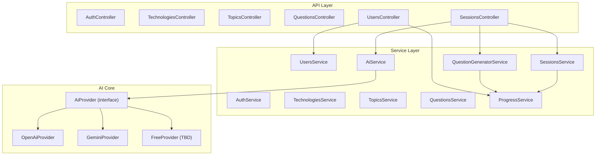
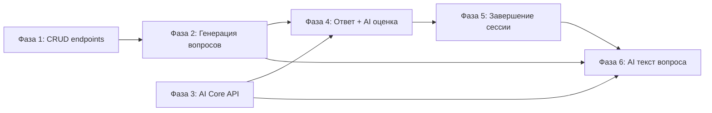

# Backend Development Roadmap — onBoard

## Текущее состояние

**Реализовано (25 эндпоинтов):**

- `GET /api/health` — healthcheck
- `POST /api/auth/register`, `POST /api/auth/login` — JWT-аутентификация
- `GET /api/technologies`, `GET /api/technologies/:id` — технологии с уровнями и топиками (с пагинацией, i18n, NotFoundException)
- `GET /api/topics?levelId=<uuid>&lang=<locale>` — топики по уровню технологии (с пагинацией, i18n, count вопросов)
- `GET /api/topics/:id?lang=<locale>` — детали топика с количеством вопросов
- `GET /api/questions?topicId=<uuid>&lang=<locale>` — вопросы по топику без explanation (с пагинацией, i18n)
- `GET /api/questions/:id?lang=<locale>` — вопрос с explanation
- `GET /api/users/me` — профиль текущего пользователя
- `GET /api/users` — список пользователей (лидерборд, с пагинацией)
- `GET /api/users/me/progress` — агрегированный прогресс по технологиям → топикам
- `GET /api/users/me/progress/topics?technologyLevelId=<uuid>` — прогресс по топикам уровня
- `GET /api/users/me/progress/questions?topicId=<uuid>` — прогресс по вопросам топика (с пагинацией)
- `POST /api/sessions`, `GET /api/sessions`, `GET /api/sessions/:id` — CRUD сессий (с пагинацией, i18n)
- `POST /api/sessions/:id/start` — запуск сессии с генерацией вопросов
- `GET /api/sessions/:id/current-question` — текущий вопрос сессии
- `POST /api/sessions/:id/skip` — пропуск вопроса (score = 0, прогресс записывается)
- `POST /api/sessions/:id/answer` — подача ответа с AI-оценкой, обновлением прогресса и автозавершением
- `POST /api/sessions/:id/finish` — завершение сессии с подсчётом баллов, обновлением fullScore и league
- `POST /api/sessions/:id/abandon` — досрочное завершение (status = abandoned), прогресс сохраняется

**Общие улучшения (Фаза 1):**

- Пагинация `skip`/`take` на всех списковых эндпоинтах через `PaginationDto`
- `NotFoundException` на `GET /:id` эндпоинтах вместо `null`
- Локализация (`?lang=ru|en`) для всех полей типа `Json` через `localize()`
- `ParseUUIDPipe` на обязательных query-параметрах (`topicId`, `levelId`, `technologyLevelId`)

**Улучшения (Фаза 2):**

- ProgressModule — переиспользуемый сервис чтения/записи прогресса (upsert, пересчёт)
- QuestionGeneratorService — round-robin алгоритм выбора вопросов из неотвеченных + fallback на low-mastery
- Автоматическое завершение сессии при пропуске последнего вопроса

**AI Core (Фаза 3):**

- AiModule (@Global) — фасад `AiService` + провайдеры `GeminiProvider`, `OpenAiProvider`
- Интерфейс `AiProvider` с методами `evaluateAnswer()` и `generateQuestionText()`
- Динамическая смена модели: `session.config.model` → `"auto"` / `"gemini"` / `"openai"` / конкретная модель
- Graceful degradation — провайдер без API-ключа помечается unavailable, сервер стартует без ошибок
- Зависимости: `@google/genai`, `openai`

**Ответ + AI-оценка (Фаза 4):**

- `POST /api/sessions/:id/answer` — подача ответа кандидата, AI-оценка через AiService
- Полный контекст передаётся в AI: текст вопроса, explanation, isDivide, предыдущие ответы, текущий mastery
- Автоматическое обновление UserQuestionProgress и UserTopicProgress после каждого ответа
- Поддержка isDivide — предыдущие ответы sessionQuestion передаются для контекстной оценки
- Если AI определяет isFullyClosed — mastery устанавливается в 1.0
- Автозавершение сессии (status = 'completed') при ответе на последний вопрос
- Модель AI выбирается из session.config.model (по умолчанию "auto")

**Завершение сессии и скоринг (Фаза 5):**

- `POST /api/sessions/:id/finish` — завершение in_progress сессии, подсчёт avgScore по всем InterviewAnswer
- Обновление User.fullScore += sessionScore и пересчёт league (bronze/silver/gold/platinum)
- `POST /api/sessions/:id/abandon` — досрочное завершение, status = 'abandoned', прогресс сохраняется
- Защита от повторного вызова finish/abandon на уже завершённой/брошенной сессии

**Не реализовано:**

- Redis подключён в Docker, но не используется в коде

## Архитектура (целевая)



---

## Фаза 1 — CRUD-эндпоинты ✅ ВЫПОЛНЕНО

Создание модулей и ручек для работы с данными, которые уже есть в БД.

### 1.1 TopicsModule ✅

Модуль `backend/src/topics/` — TopicsController, TopicsService, TopicsModule.

- ✅ `GET /api/topics?levelId=<uuid>&lang=ru` — список топиков по `technologyLevelId` с пагинацией и count вопросов.
- ✅ `GET /api/topics/:id?lang=ru` — один топик с количеством вопросов и `NotFoundException`.

### 1.2 QuestionsModule ✅

Модуль `backend/src/questions/` — QuestionsController, QuestionsService, QuestionsModule.

- ✅ `GET /api/questions?topicId=<uuid>&lang=ru` — список вопросов по topicId без explanation, с пагинацией.
- ✅ `GET /api/questions/:id?lang=ru` — один вопрос с explanation и `NotFoundException`.

### 1.3 UsersModule ✅

Модуль `backend/src/users/` — UsersController, UsersService, UsersModule.

- ✅ `GET /api/users/me` — профиль текущего пользователя.
- ✅ `GET /api/users` — список пользователей (лидерборд) с пагинацией, отсортирован по fullScore.
- ✅ `GET /api/users/me/progress` — агрегированный прогресс: технологии → уровни → топики.
- ✅ `GET /api/users/me/progress/topics?technologyLevelId=<uuid>` — прогресс по топикам уровня.
- ✅ `GET /api/users/me/progress/questions?topicId=<uuid>` — прогресс по вопросам топика с пагинацией.

### 1.4 Исправления в существующих модулях ✅

- ✅ `TechnologiesService.findOne()` — `NotFoundException` вместо возврата `null`.
- ✅ Пагинация `skip`/`take` добавлена во все списковые эндпоинты через общий `PaginationDto`.
- ✅ Исправлен импорт PrismaClient (`@prisma/client` вместо `.prisma/client`).

---

## Фаза 2 — Генерация вопросов и старт сессии ✅ ВЫПОЛНЕНО

### 2.1 ProgressService (переиспользуемый сервис) ✅

Новый модуль `backend/src/progress/` — отвечает за чтение и запись прогресса.

- ✅ `getQuestionProgress(userId, questionId)` — прогресс по одному вопросу
- ✅ `getTopicProgress(userId, topicId)` — прогресс по одному топику
- ✅ `getUnansweredQuestions(userId, technologyLevelId)` — вопросы без прогресса для данного уровня
- ✅ `getLowestMasteryQuestions(userId, technologyLevelId, limit)` — вопросы с наименьшим mastery (fallback)
- ✅ `updateQuestionProgress(userId, questionId, score)` — upsert прогресса
- ✅ `recalcTopicProgress(userId, topicId)` — пересчёт агрегата по топику

Этот сервис будет использоваться и в UsersModule (фаза 1), и в SessionsModule (фаза 2), и в AI-оценке (фаза 4).

### 2.2 QuestionGeneratorService ✅

Сервис в `backend/src/sessions/question-generator.service.ts`.

**Алгоритм v1 (простой, без AI):**

```
1. Получить все topicIds для данного technologyLevelId (через TechnologyLevelTopic)
2. Для каждого topic:
   a. Получить вопросы без прогресса (UserQuestionProgress не существует для userId+questionId)
   b. Взять первый такой вопрос
3. Если вопросов набралось < totalQuestions:
   a. Повторить цикл по топикам, беря следующий вопрос без прогресса
   b. Если все вопросы с прогрессом — брать вопросы с наименьшим mastery
4. Для каждого выбранного вопроса:
   - Создать InterviewSessionQuestion с questionText = localize(question.text, locale), difficulty, order
5. Вернуть список InterviewSessionQuestion
```

### 2.3 Новые эндпоинты в SessionsController ✅

- ✅ `POST /api/sessions/:id/start` — запуск сессии:
  1. Проверить status === 'planned', принадлежность userId
  2. Вызвать QuestionGeneratorService для генерации вопросов
  3. Обновить session: status = 'in_progress', startedAt = now(), currentOrder = 1
  4. Вернуть сессию с первым вопросом
- ✅ `GET /api/sessions/:id/current-question` — получить текущий вопрос сессии:
  1. Найти InterviewSessionQuestion по sessionId и order === session.currentOrder
  2. Вернуть questionText, difficulty, order, totalQuestions
- ✅ `POST /api/sessions/:id/skip` — пропуск вопроса (currentOrder++, score = 0, обновление прогресса)

---

## Фаза 3 — AI Core API ✅ ВЫПОЛНЕНО

### 3.1 AiModule ✅

Новый модуль `backend/src/ai/` — `@Global`, экспортирует `AiService`.

*На текущий момент в .env проекта подключен api_key для Gemini ( выбрать free tear модель для подключения - в .env есть переменные: GEMINI_API_KEY, (GEMINI_PROJECT_NAME, GEMINI_PROJECT_NUMBER - при необходимости))

**Структура:**

```
ai/
  ai.module.ts           — @Global модуль
  ai.service.ts          — фасад, выбирает провайдер по конфигу
  ai.interfaces.ts       — AiProvider interface, типы запросов/ответов, системные промпты
  providers/
    openai.provider.ts   — OpenAI (GPT-4o / GPT-4o-mini)
    gemini.provider.ts   — Google Gemini (2.0 Flash — бесплатный tier)
```

**Интерфейс провайдера:**

```typescript
interface AiProvider {
  readonly name: string;
  evaluateAnswer(ctx: EvaluateAnswerContext): Promise<EvaluationResult>;
  generateQuestionText(ctx: GenerateQuestionContext): Promise<string>;
}

interface EvaluateAnswerContext {
  questionText: string;
  questionExplanation: string;
  answerText: string;
  previousAnswers?: { text: string; feedback: string; score: number }[];
  isDivide: boolean;
  currentMastery: number;
}

interface EvaluationResult {
  score: number;          // 0-100
  feedback: string;       // текстовый разбор
  isFullyClosed: boolean; // вопрос закрыт полностью
  recommendations: string[];
}

interface GenerateQuestionContext {
  originalQuestionText: string;
  explanation: string;
  previousAnswers: { text: string; feedback: string; score: number }[];
  currentMastery: number;
}
```

### 3.2 Динамическая смена модели ✅

- ✅ Конфиг модели хранится в `session.config.model` (например `"gemini-2.0-flash"`, `"gpt-4o-mini"`, `"auto"`)
- ✅ `AiService.getProvider(modelName)` — возвращает нужный провайдер по имени
- ✅ Режим `"auto"` — выбирает бесплатную модель по умолчанию (приоритет: Gemini → OpenAI)
- ✅ `AiService.hasProviders()` и `AiService.getAvailableProviders()` — диагностика
- ✅ Фасадные методы: `evaluateAnswer(ctx, modelName?)`, `generateQuestionText(ctx, modelName?)`

### 3.3 Провайдеры ✅

- ✅ **GeminiProvider** — `@google/genai` → `GoogleGenAI`. Модель по умолчанию: `gemini-2.0-flash` (env: `GEMINI_MODEL`). API-ключ: `GEMINI_API_KEY`.
- ✅ **OpenAiProvider** — `openai` → `OpenAI`. Модель по умолчанию: `gpt-4o-mini` (env: `OPENAI_MODEL`). API-ключ: `OPENAI_API_KEY`.
- ✅ Graceful degradation: если API-ключ не задан, провайдер помечается `unavailable`, сервер стартует без ошибок.
- ✅ JSON-парсинг ответов с fallback на сырой текст при ошибке парсинга.

### 3.4 Бесплатные модели — шаги подключения

Исследование рынка (на момент 2026):

- **Google Gemini 2.0 Flash** — бесплатный tier через AI Studio API (15 RPM, 1M tokens/day). Лучший кандидат для MVP.
  - Шаги: получить API key в Google AI Studio → задать `GEMINI_API_KEY` в `.env`
- **Groq** — бесплатный tier для open-source моделей (Llama 3, Mixtral). Высокая скорость.
  - Шаги: регистрация на groq.com → API key → можно добавить как OpenAI-compatible провайдер
- **OpenRouter** — агрегатор, некоторые модели бесплатны
  - Шаги: регистрация → API key → OpenAI-compatible API

**Рекомендация для MVP**: начать с Gemini 2.0 Flash (бесплатно, достаточное качество для оценки ответов).

### 3.5 Диагностика моделей ✅

- ✅ Добавлен защищённый `AiController` с `GET /api/ai/providers` для просмотра зарегистрированных провайдеров, `modelId`, алиасов и default-маршрутизации.
- ✅ Добавлен `POST /api/ai/test` для lightweight-проверки одной модели или всех доступных моделей через реальные вызовы `evaluateAnswer` или `generateQuestionText`.
- ✅ `AiService` возвращает детальный summary по проверке: `success`, `latencyMs`, итог вызова или текст ошибки без падения всего endpoint.
- ✅ Добавлены unit-тесты на диагностику, dedupe провайдеров по алиасам и обработку ошибок провайдера.

### 3.6 Gemini Egress Mitigation ✅

- ✅ Добавлен `GET /api/ai/egress` для диагностики outbound path Gemini: public IP, geo probe, DNS lookup, local interfaces, proxy mode, IPv4 preference.
- ✅ `GeminiProvider` получил transport-конфиг через env: `GEMINI_PROXY_URL`, `GEMINI_BASE_URL`, `GEMINI_FORCE_IPV4`.
- ✅ При `GEMINI_PROXY_URL` backend включает upstream через `undici` global dispatcher и логирует, что fetch-based трафик процесса идет через тот же proxy.

---

## Фаза 4 — Процесс ответа на вопрос (ядро продукта) ✅ ВЫПОЛНЕНО

### 4.1 Подача ответа ✅

`POST /api/sessions/:id/answer`

```
Body: { answerText: string }

Алгоритм (реализован в SessionsService.answer()):
1. Валидация: session.status === 'in_progress', userId совпадает
2. Получить текущий InterviewSessionQuestion (по currentOrder) с answers
3. Получить оригинальный Question (для explanation, isDivide)
4. Получить предыдущие InterviewAnswer для этого sessionQuestion (если isDivide)
5. Получить UserQuestionProgress (текущий mastery)
6. Вызвать AiService.evaluateAnswer() с полным контекстом
7. Создать InterviewAnswer (answerText, aiFeedback, score)
8. Обновить UserQuestionProgress через ProgressService.updateQuestionProgress():
   - attemptsCount++
   - totalScore += score
   - lastScore = score
   - mastery = min(totalScore / (attempts * 100), 1.0)
   - lastAnsweredAt = now()
9. Если AI определил isFullyClosed — mastery принудительно = 1.0
10. Обновить UserTopicProgress через ProgressService.recalcTopicProgress()
11. Увеличить session.currentOrder++
12. Если currentOrder > totalQuestions — автоматическое завершение (status = 'completed')
13. Вернуть: { answerId, score, feedback, isFullyClosed, recommendations, currentOrder, status, isFinished, nextQuestion? }
```

- ✅ Модель AI берётся из `session.config.model` (по умолчанию `"auto"`)
- ✅ Валидация через `AnswerQuestionDto` (`@IsString()`, `@MinLength(1)`)
- ✅ `ParseUUIDPipe` на `:id` параметре
- ✅ JWT-аутентификация через `JwtAuthGuard`

### 4.2 Логика isDivide ✅

Для вопросов с `isDivide = true`:

- ✅ Предыдущие ответы (`InterviewAnswer[]`) для данного `sessionQuestion` передаются в контекст AI
- ✅ AI учитывает все предыдущие ответы при оценке полноты раскрытия вопроса
- ✅ При `isFullyClosed = true` mastery устанавливается в 1.0 независимо от формулы

### 4.3 Статус вопроса (решение)

Выбрана альтернатива **без миграции** — статус вычисляется на лету из mastery:

- `mastery === 0` → open (нет прогресса / все попытки с score 0)
- `0 < mastery < 1.0` → in_progress
- `mastery === 1.0` → closed (AI подтвердил полное раскрытие или набрана максимальная оценка)

---

## Фаза 5 — Завершение сессии и скоринг ✅ ВЫПОЛНЕНО

### 5.1 Завершение сессии ✅

`POST /api/sessions/:id/finish`

```
Алгоритм (реализован в SessionsService.finish()):
1. Валидация: session.status === 'in_progress', userId совпадает
2. Получить все InterviewAnswer для данной сессии
3. Подсчитать avgScore = round(sum(score) / count)
4. sessionScore = avgScore
5. Обновить session: status = 'completed', finishedAt = now()
6. Обновить User.fullScore += sessionScore
7. Пересчитать league через computeLeague():
   - bronze: 0-99
   - silver: 100-499
   - gold: 500-999
   - platinum: 1000+
8. Вернуть: { sessionId, status, totalQuestions, questionsAnswered, avgScore, sessionScore, newFullScore, newLeague }
```

- ✅ `ParseUUIDPipe` на `:id`, JWT-аутентификация
- ✅ Защита от повторного finish (400 для не-in_progress)
- ✅ `computeLeague()` — статический метод с конфигурируемыми порогами

### 5.2 Досрочное завершение ✅

`POST /api/sessions/:id/abandon`

- ✅ Устанавливает status = `'abandoned'`, finishedAt = now()
- ✅ Прогресс по отвеченным/пропущенным вопросам сохраняется (UserQuestionProgress не затрагивается)
- ✅ Возвращает `{ sessionId, status }`
- ✅ Защита от повторного abandon (400 для не-in_progress)

---

## Фаза 6 — AI-генерация текста вопроса

### 6.0 Анализ сущностей БД и план (актуализация)

**Как сохраняется история вопрос→ответ.** Прямой связи между `InterviewAnswer` и `User`/`Question` в схеме нет. История собирается через цепочку:

```
InterviewAnswer.sessionQuestionId
  → InterviewSessionQuestion (questionId, sessionId)
    → InterviewSession (userId)
    → Question
```

Все попытки пользователя по одному вопросу можно получить запросом:

```ts
prisma.interviewAnswer.findMany({
  where: { sessionQuestion: { questionId, session: { userId } } },
  orderBy: { createdAt: 'asc' },
});
```

**Критерий «вопрос уже задавался и не закрыт».** Ориентируемся на `UserQuestionProgress.mastery`:

- `mastery === 0` или записи нет → вопрос задаётся в оригинале (`localize(question.text, locale)`).
- `0 < mastery < 1` → вопрос требует уточняющей формулировки через AI.
- `mastery === 1` (AI закрыл или набрана максимальная оценка) → в выборку такой вопрос уже не попадает.

**Критический gap.** Сейчас `InterviewAnswer` хранит только `answerText`, `aiFeedback`, `score`. Поле `recommendations` из `EvaluationResult` **теряется**, хотя именно оно отмечает незакрытые моменты ответа. Для качественной генерации уточняющего вопроса нужно:

1. Добавить в `InterviewAnswer` поле `recommendations Json?` (массив строк) и сохранять его в `SessionsService.answer()`.
2. Построить ручку для получения полной истории попыток пользователя по `questionId`.
3. Только после этого расширять `QuestionGeneratorService` AI-генерацией.

### 6.1 Миграция БД — `InterviewAnswer.recommendations`

- Расширить модель `InterviewAnswer`:

```prisma
model InterviewAnswer {
  // ... существующие поля
  recommendations Json?
}
```

- Новая миграция `20260422_add_interview_answer_recommendations`.
- `SessionsService.answer()` сохраняет `evaluation.recommendations` в новом поле, остальная логика (mastery, recalc) не меняется.

### 6.2 Эндпоинт истории ответов пользователя по вопросу

`GET /api/users/me/questions/:questionId/history?lang=<locale>`

Алгоритм (`UsersService.getQuestionAnswerHistory`):

1. Найти `Question` по `questionId` с `NotFoundException` при отсутствии.
2. Получить `UserQuestionProgress` для `(userId, questionId)` — агрегаты (`mastery`, `attemptsCount`, `totalScore`, `lastScore`, `lastAnsweredAt`).
3. Получить все `InterviewAnswer`, где `sessionQuestion.questionId === questionId` и `session.userId === userId`, отсортированные по `createdAt ASC`; включить `sessionQuestion.session` (`sessionId`, `createdAt`) и сам `questionText` (он мог отличаться от оригинала — для AI-уточнённых вопросов).
4. Вернуть:

```ts
{
  question: { id, text: localized, type, difficulty, isDivide },
  progress: { attemptsCount, totalScore, lastScore, mastery, lastAnsweredAt } | null,
  attempts: Array<{
    answerId, sessionId, sessionQuestionId,
    questionText,           // то, что реально задавали пользователю (могло быть уточнённым)
    answerText, score, feedback, recommendations,
    createdAt,
  }>;
}
```

Эндпоинт защищён `JwtAuthGuard`, `:questionId` валидируется `ParseUUIDPipe`.

### 6.3 AI-генерация уточняющего текста в `QuestionGeneratorService`

**Контракт обновляется:**

```ts
interface GenerateQuestionContext {
  originalQuestionText: string;
  explanation: string;
  previousAnswers: Array<{
    text: string;
    feedback: string;
    recommendations: string[];   // новое — незакрытые моменты
    score: number;
  }>;
  currentMastery: number;
}
```

**Алгоритм генерации (для каждого выбранного вопроса):**

```
1. progress = UserQuestionProgress(userId, questionId)
2. Если progress отсутствует ИЛИ progress.mastery === 0 ИЛИ AI недоступен:
     questionText = localize(question.text, locale)
3. Иначе (0 < mastery < 1):
   a. attempts = InterviewAnswer[] пользователя по questionId (через join), последние N (≈5)
   b. ctx.previousAnswers = attempts.map(text/feedback/score/recommendations)
   c. questionText = await aiService.generateQuestionText(ctx, session.config.model)
   d. При ошибке AI — fallback на оригинал + warn в лог
4. Создать InterviewSessionQuestion c questionText
```

- Метод генерации выносится во вспомогательный `QuestionGeneratorService.resolveQuestionText()` для переиспользования и тестирования.
- `AiService.hasProviders()` используется как быстрая проверка доступности.

### 6.4 Обновление промпта `QUESTION_GEN_SYSTEM_PROMPT`

Добавить явное требование:

- Сформулировать один follow-up вопрос так, чтобы он закрывал наибольший gap из `recommendations` и общего низкого `score`.
- Не повторять уже раскрытое в предыдущих ответах.
- Ограничение по языку: язык оригинального вопроса / последнего ответа.

### 6.5 Тесты

- `sessions.service.spec.ts` — `answer()` записывает `recommendations` в `InterviewAnswer.create`.
- `question-generator.service.spec.ts` — новый файл:
  - вопрос без прогресса → `localize()`, AI не вызывается;
  - вопрос с `mastery ∈ (0;1)` → `aiService.generateQuestionText` вызывается с историей + recommendations;
  - AI бросает ошибку → fallback на `localize()`, сессия создаётся;
  - нет зарегистрированных провайдеров → AI не вызывается.
- `users.service.spec.ts` (опционально) — `getQuestionAnswerHistory` корректно собирает attempts из разных сессий.

---

## Порядок реализации и зависимости



Фазы 1 и 3 можно начинать параллельно. Фазы 4-6 зависят от предыдущих.

---

## Ключевые файлы для изменения/создания

**Созданные модули (Фаза 1):**

- ✅ `backend/src/topics/` — TopicsModule, TopicsController, TopicsService
- ✅ `backend/src/questions/` — QuestionsModule, QuestionsController, QuestionsService
- ✅ `backend/src/users/` — UsersModule, UsersController, UsersService
- ✅ `backend/src/common/dto/pagination.dto.ts` — общий DTO для пагинации

**Созданные модули (Фаза 2):**

- ✅ `backend/src/progress/` — ProgressModule, ProgressService
- ✅ `backend/src/sessions/question-generator.service.ts` — QuestionGeneratorService

**Созданные модули (Фаза 3):**

- ✅ `backend/src/ai/ai.module.ts` — @Global AiModule
- ✅ `backend/src/ai/ai.service.ts` — AiService фасад
- ✅ `backend/src/ai/ai.interfaces.ts` — интерфейсы и системные промпты
- ✅ `backend/src/ai/providers/gemini.provider.ts` — GeminiProvider
- ✅ `backend/src/ai/providers/openai.provider.ts` — OpenAiProvider

**Модифицированные файлы (Фаза 1):**

- ✅ `backend/src/app.module.ts` — импорт TopicsModule, QuestionsModule, UsersModule
- ✅ `backend/src/technologies/technologies.service.ts` — NotFoundException, пагинация
- ✅ `backend/src/technologies/technologies.controller.ts` — пагинация
- ✅ `backend/src/sessions/sessions.service.ts` — пагинация
- ✅ `backend/src/sessions/sessions.controller.ts` — пагинация
- ✅ `backend/src/prisma/prisma.service.ts` — исправлен импорт PrismaClient

**Модифицированные файлы (Фаза 2):**

- ✅ `backend/src/app.module.ts` — импорт ProgressModule
- ✅ `backend/src/sessions/sessions.module.ts` — импорт ProgressModule, QuestionGeneratorService
- ✅ `backend/src/sessions/sessions.service.ts` — методы start, getCurrentQuestion, skip
- ✅ `backend/src/sessions/sessions.controller.ts` — эндпоинты start, current-question, skip + ParseUUIDPipe

**Модифицированные файлы (Фаза 3):**

- ✅ `backend/src/app.module.ts` — импорт AiModule
- ✅ `backend/.env` — добавлены `GEMINI_API_KEY`, `OPENAI_API_KEY`
- ✅ `backend/src/progress/progress.service.ts` — AI-NOTE комментарии
- ✅ `backend/src/sessions/question-generator.service.ts` — AI-NOTE комментарии
- ✅ `backend/src/sessions/sessions.service.ts` — AI-NOTE комментарии

**Созданные файлы (Фаза 4):**

- ✅ `backend/src/sessions/dto/answer-question.dto.ts` — DTO для подачи ответа
- ✅ `backend/src/sessions/sessions.service.spec.ts` — unit-тесты answer flow (8 тестов)

**Модифицированные файлы (Фаза 4):**

- ✅ `backend/src/sessions/sessions.service.ts` — метод `answer()`, инъекция `AiService`
- ✅ `backend/src/sessions/sessions.controller.ts` — эндпоинт `POST :id/answer`

**Модифицированные файлы (Фаза 5):**

- ✅ `backend/src/sessions/sessions.service.ts` — методы `finish()`, `abandon()`, `computeLeague()`
- ✅ `backend/src/sessions/sessions.controller.ts` — эндпоинты `POST :id/finish`, `POST :id/abandon`
- ✅ `backend/src/sessions/sessions.service.spec.ts` — unit-тесты finish/abandon/computeLeague (16 новых тестов)

**Предстоящие модификации (Фаза 6):**

- `backend/prisma/schema.prisma` — поле `InterviewAnswer.recommendations Json?`
- `backend/prisma/migrations/<timestamp>_add_interview_answer_recommendations/` — миграция
- `backend/src/sessions/sessions.service.ts` — сохранение `evaluation.recommendations`
- `backend/src/users/users.service.ts` — метод `getQuestionAnswerHistory`
- `backend/src/users/users.controller.ts` — эндпоинт `GET /api/users/me/questions/:questionId/history`
- `backend/src/ai/ai.interfaces.ts` — расширение `GenerateQuestionContext` и `QUESTION_GEN_SYSTEM_PROMPT`
- `backend/src/sessions/question-generator.service.ts` — AI-генерация уточняющего текста для вопросов с `0 < mastery < 1`, fallback на `localize`
- `backend/src/sessions/question-generator.service.spec.ts` — новые unit-тесты
- `backend/src/sessions/sessions.service.spec.ts` — тесты на сохранение `recommendations`
