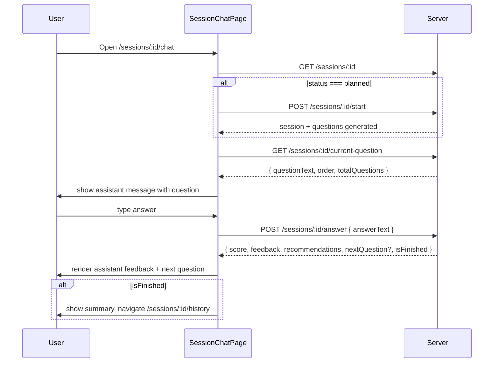
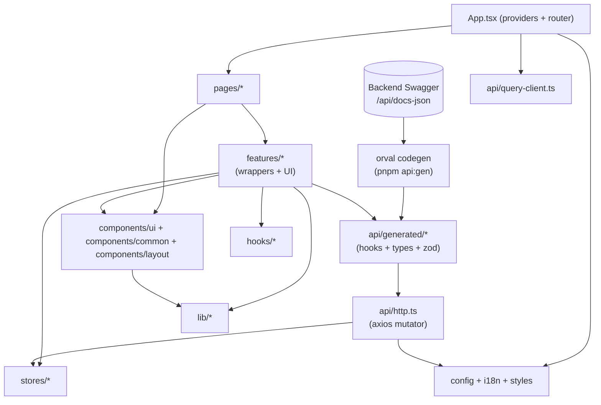
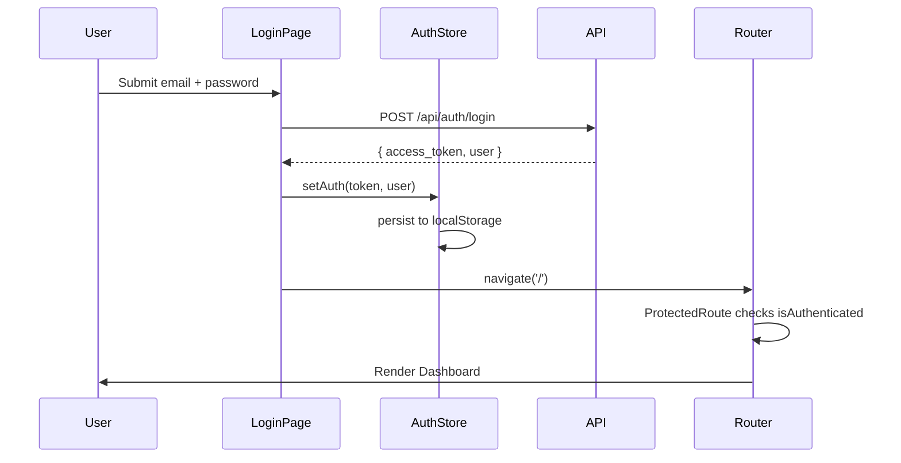
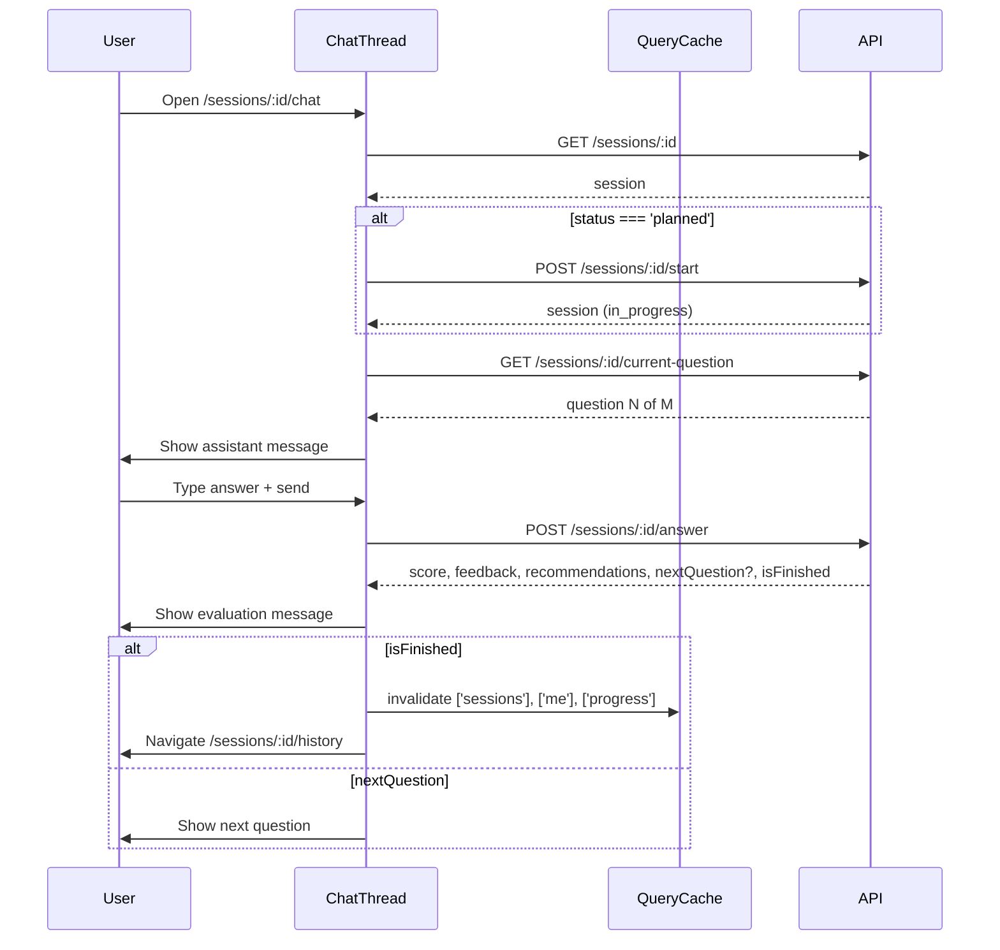
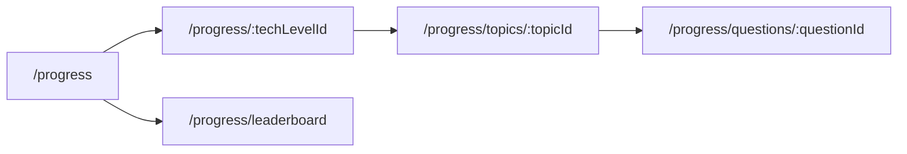

# Frontend Development Roadmap — onBoard

> Полный roadmap для переписки фронтенда onBoard с нуля: от сноса чернового SPA до production-ready приложения со стандартной структурой React + Vite, shadcn-дизайн-системой и интеграцией со всеми 25 реализованными бэкенд-эндпоинтами.
>
> Источник истины по API: [BACKEND_ROADMAP.md](BACKEND_ROADMAP.md), строки 7-26.

---

## 1. Цели и текущее состояние

### Цели

- Полностью функциональный SPA поверх NestJS-бэкенда onBoard.
- Собственная визуальная тема: белый фон, светло-серые поверхности, **салатовый** акцент.
- Дизайн-система на базе [shadcn/ui](https://ui.shadcn.com/) с настройкой цветов под тему.
- 5 основных страниц: Dashboard, Sessions, Session (чат с AI), Progress, Profile.
- Стандартная структура React + Vite (feature-based группировка, без экзотических архитектур).
- Локализация (ru/en), доступность (a11y), адаптивная верстка (mobile-first), performance (code-splitting, prefetch).

### Что сейчас есть (`frontend/`)

Черновой React 19 + Vite 7 SPA. Стек уже подходит для нового приложения, UI — **сносим полностью**.

- Dependencies: `react@19`, `react-router-dom@6`, `@tanstack/react-query@5`, `zustand@5`, `axios@1`, `react-hook-form@7`, `tailwindcss@4`, `@tailwindcss/vite@4`.
- 3 страницы (сносим): [frontend/src/pages/LoginPage.tsx](frontend/src/pages/LoginPage.tsx), [frontend/src/pages/RegisterPage.tsx](frontend/src/pages/RegisterPage.tsx), [frontend/src/pages/DashboardPage.tsx](frontend/src/pages/DashboardPage.tsx) — тёмная indigo-тема, Tailwind inline-классы, без дизайн-системы.
- Роутинг в [frontend/src/App.tsx](frontend/src/App.tsx) — 3 маршрута (`/login`, `/register`, `/`), простые PublicRoute/PrivateRoute.
- API-клиент [frontend/src/api/client.ts](frontend/src/api/client.ts) — axios + Bearer-токен + 401-redirect. **Переносим в `src/api/http.ts` как отправную точку.**
- Auth-store [frontend/src/store/auth.ts](frontend/src/store/auth.ts) — zustand без middleware, ручная работа с localStorage. **Переписываем на `zustand/middleware persist` в `src/stores/auth.store.ts`.**
- Прокси `/api → localhost:3000` в [frontend/vite.config.ts](frontend/vite.config.ts) — оставляем, добавляем алиас `@/*`.

### Что переиспользуем

- Идеи из `api/client.ts` (axios instance + interceptor).
- Концепцию Zustand-store для сессии пользователя.
- Настройки TS (`strict: true`, `noUnusedLocals`, `verbatimModuleSyntax`) из [frontend/tsconfig.app.json](frontend/tsconfig.app.json).

### Что полностью сносим

- Все страницы `frontend/src/pages/*`.
- Все ad-hoc-стили (indigo-тема, `bg-gray-900` и т.п.).
- `frontend/src/types/index.ts` — **все API-типы будут генерироваться `orval` из Swagger**, самописных DTO не будет.
- `frontend/src/api/{auth,sessions,technologies}.ts` — **все API-хуки и клиенты будут генерироваться `orval`** (`useLogin`, `useGetSessions` и т.д.), самописных api-модулей не будет.

---

## 2. Стек и ключевые решения

| Категория | Выбор | Обоснование |
|-----------|-------|-------------|
| Сборщик | Vite 7 | Уже стоит, быстрый HMR |
| Framework | React 19 + TypeScript strict | Уже стоит |
| Стили | Tailwind CSS v4 + `@theme inline` | Уже стоит, нативные CSS-переменные, без `tailwind.config.js` |
| Дизайн-система | shadcn/ui (Radix primitives) | Копирование компонентов → полный контроль над темой |
| Роутер | React Router v6 (data router) | Уже стоит; `createBrowserRouter` + `loader`/`action` паттерны |
| Data-fetching | TanStack Query v5 | Уже стоит; кэш, retry, optimistic updates |
| **API-клиент и типы** | **`orval` — кодогенерация из Swagger/OpenAPI бэкенда** | **Ни одного самописного хука/DTO: `orval` создаёт TanStack Query хуки + типы + zod-схемы из `/api/docs-json`. Source of truth — Swagger NestJS'а.** |
| UI-стейт | Zustand v5 + `persist` middleware | Уже стоит; минимальный boilerplate |
| Формы | react-hook-form + zod | уже стоит rhf, добавим zod + `@hookform/resolvers/zod` |
| Иконки | lucide-react | Стандарт для shadcn |
| Чат | `@assistant-ui/react` + `@assistant-ui/react-ui` + `@assistant-ui/styles` | Готовое решение с поддержкой shadcn-темы |
| Даты | date-fns | Минимальный размер, tree-shakeable |
| i18n | react-i18next + i18next-browser-languagedetector | Де-факто стандарт |
| Уведомления | `sonner` (включен в shadcn) | Лёгкий, accessible |
| Структура | Feature-based, стандартная для React + Vite | Без лишних абстракций, близко к best practices Vite/Next-сообщества |
| Линтеры | ESLint 9 flat config | Уже стоит |
| Dev-tools | `@tanstack/react-query-devtools`, React DevTools | Отладка |

### Новые зависимости (будут поставлены в фазе 0)

```bash
# shadcn core deps
pnpm add class-variance-authority clsx tailwind-merge tw-animate-css
pnpm add @radix-ui/react-slot lucide-react
pnpm add sonner

# forms & validation
pnpm add zod @hookform/resolvers

# chat
pnpm add @assistant-ui/react @assistant-ui/react-ui @assistant-ui/styles @assistant-ui/react-markdown

# i18n
pnpm add react-i18next i18next i18next-browser-languagedetector

# utils
pnpm add date-fns

# dev
pnpm add -D @tanstack/react-query-devtools

# API codegen (orval)
pnpm add -D orval
# peer-tools для zod-схем (orval поддерживает генерацию zod-валидаторов запросов/ответов)
pnpm add -D openapi-typescript
```

---

## 3. Тема и дизайн-система

### Палитра

Светлая тема — единственная в MVP. Опциональный dark-mode — в фазе 11.

| Токен | OKLCH | Назначение |
|-------|-------|------------|
| `--background` | `oklch(1 0 0)` (белый) | Фон страниц |
| `--foreground` | `oklch(0.18 0.01 240)` (почти чёрный) | Основной текст |
| `--card` | `oklch(1 0 0)` | Фон карточек |
| `--card-foreground` | `oklch(0.18 0.01 240)` | Текст на карточках |
| `--muted` | `oklch(0.97 0.005 240)` (светло-серый) | Фон второстепенных блоков |
| `--muted-foreground` | `oklch(0.5 0.01 240)` | Второстепенный текст |
| `--border` | `oklch(0.93 0.005 240)` | Границы |
| `--input` | `oklch(0.93 0.005 240)` | Границы инпутов |
| `--ring` | `oklch(0.78 0.17 145)` | Focus-ring (салатовый) |
| `--primary` | `oklch(0.78 0.17 145)` | **Акцент (приятный салатовый)** |
| `--primary-foreground` | `oklch(0.18 0.01 240)` | Тёмный текст на салатовом |
| `--secondary` | `oklch(0.97 0.005 240)` | Вторичные кнопки |
| `--secondary-foreground` | `oklch(0.18 0.01 240)` | Текст secondary |
| `--accent` | `oklch(0.94 0.04 145)` (бледно-салатовый) | Hover-подсветка |
| `--accent-foreground` | `oklch(0.25 0.05 145)` | Текст на accent |
| `--destructive` | `oklch(0.62 0.22 25)` | Ошибки/опасные действия |
| `--success` | `oklch(0.72 0.17 145)` | Успех, скор >= 70 |
| `--warning` | `oklch(0.82 0.15 85)` | Внимание, скор 40-69 |

### Токены размеров / радиусов / теней

| Токен | Значение |
|-------|----------|
| `--radius` | `0.75rem` (12px) — дружелюбный, не перекошенный |
| `--font-sans` | `"Inter", ui-sans-serif, system-ui, sans-serif` |
| `--font-mono` | `"JetBrains Mono", ui-monospace, SFMono-Regular, monospace` |
| `--shadow-sm` | `0 1px 2px 0 oklch(0 0 0 / 0.05)` |
| `--shadow-md` | `0 4px 12px -2px oklch(0 0 0 / 0.08)` |
| `--shadow-lg` | `0 12px 28px -8px oklch(0 0 0 / 0.12)` |

### `frontend/src/styles/index.css` (фрагмент)

```css
@import "tailwindcss";
@import "tw-animate-css";

@theme inline {
  --color-background: var(--background);
  --color-foreground: var(--foreground);
  --color-card: var(--card);
  --color-card-foreground: var(--card-foreground);
  --color-muted: var(--muted);
  --color-muted-foreground: var(--muted-foreground);
  --color-border: var(--border);
  --color-input: var(--input);
  --color-ring: var(--ring);
  --color-primary: var(--primary);
  --color-primary-foreground: var(--primary-foreground);
  --color-secondary: var(--secondary);
  --color-secondary-foreground: var(--secondary-foreground);
  --color-accent: var(--accent);
  --color-accent-foreground: var(--accent-foreground);
  --color-destructive: var(--destructive);
  --color-success: var(--success);
  --color-warning: var(--warning);

  --radius-sm: calc(var(--radius) - 4px);
  --radius-md: calc(var(--radius) - 2px);
  --radius-lg: var(--radius);
  --radius-xl: calc(var(--radius) + 4px);

  --font-sans: "Inter", ui-sans-serif, system-ui, sans-serif;
  --font-mono: "JetBrains Mono", ui-monospace, SFMono-Regular, monospace;
}

:root {
  --radius: 0.75rem;
  --background: oklch(1 0 0);
  --foreground: oklch(0.18 0.01 240);
  --card: oklch(1 0 0);
  --card-foreground: oklch(0.18 0.01 240);
  --muted: oklch(0.97 0.005 240);
  --muted-foreground: oklch(0.5 0.01 240);
  --border: oklch(0.93 0.005 240);
  --input: oklch(0.93 0.005 240);
  --ring: oklch(0.78 0.17 145);
  --primary: oklch(0.78 0.17 145);
  --primary-foreground: oklch(0.18 0.01 240);
  --secondary: oklch(0.97 0.005 240);
  --secondary-foreground: oklch(0.18 0.01 240);
  --accent: oklch(0.94 0.04 145);
  --accent-foreground: oklch(0.25 0.05 145);
  --destructive: oklch(0.62 0.22 25);
  --success: oklch(0.72 0.17 145);
  --warning: oklch(0.82 0.15 85);
}

@layer base {
  * { @apply border-border; }
  body { @apply bg-background text-foreground font-sans antialiased; }
}
```

### Состояния компонентов (стандарты)

- **hover**: фон `accent`, текст `accent-foreground`.
- **focus**: outline none + `ring-2 ring-ring ring-offset-2 ring-offset-background`.
- **disabled**: `opacity-50 cursor-not-allowed pointer-events-none`.
- **active/pressed**: `translate-y-[1px]` для кнопок.
- **loading**: заменяем иконку/текст на `<Loader2 className="animate-spin"/>`.

### Иллюстрации пустых состояний

Единый паттерн `<EmptyState icon={...} title={...} description={...} action={...} />` в `src/components/common/empty-state.tsx`. Иконки из `lucide-react` (`Inbox`, `Sparkles`, `TrendingUp`).

---

## 4. Структура проекта

Стандартная feature-based структура React + Vite. Никаких «слоёв с правилами зависимостей» — только здравый смысл: общие штуки в `components/`, `hooks/`, `lib/`, `stores/`, крупные домены — в `features/`, тонкие страницы-роуты — в `pages/`.

```
frontend/src/
  api/                       # API-слой: axios mutator + сгенерированный orval-код
    http.ts                  # кастомный axios-инстанс + interceptors (mutator для orval)
    query-client.ts          # TanStack QueryClient + defaults
    generated/               # ! ГЕНЕРИРУЕТСЯ orval, НЕ РЕДАКТИРУЕТСЯ ВРУЧНУЮ
      endpoints.ts           # все хуки: useLogin, useGetSessions, usePostSessions, ...
      schemas/               # TypeScript-типы по схемам Swagger (User, Session, ...)
        index.ts
        user.ts
        session.ts
        interviewAnswer.ts
        ...
      zod.ts                 # zod-валидаторы запросов/ответов (опционально)

  components/
    ui/                      # shadcn-компоненты (Button, Card, Dialog, ...)
    layout/
      AppLayout.tsx          # обёртка авторизованной зоны (Sidebar + Topbar)
      AuthLayout.tsx         # центрированная карточка для login/register
      Sidebar.tsx
      Topbar.tsx
      LanguageSwitcher.tsx
      UserMenu.tsx
      ProtectedRoute.tsx     # guard для авторизованных роутов
      PublicRoute.tsx        # guard для /login, /register
    common/                  # переиспользуемые prezentational компоненты
      EmptyState.tsx
      PageHeader.tsx
      StatCard.tsx
      ScoreBadge.tsx
      LeagueBadge.tsx
      UserAvatar.tsx
      ErrorBoundary.tsx
      SkeletonList.tsx

  features/                  # крупные доменные блоки
    auth/
      components/
        LoginForm.tsx
        RegisterForm.tsx
      hooks/
        useLogin.ts
        useRegister.ts
      schemas.ts             # zod-схемы
    dashboard/
      components/
        ContinueOrStartWidget.tsx
        StartSessionDialog.tsx
        RecentQuestionsWidget.tsx
        LeagueTopWidget.tsx
        MyTopTechnologiesWidget.tsx
        FavoritesWidget.tsx
      hooks/
        useStartSession.ts      # wrapper: create → start → navigate
    sessions/
      components/
        SessionCard.tsx
        SessionStatusBadge.tsx
        SessionsTabs.tsx
      hooks/
        useSessionActions.ts    # wrapper: abandon/finish/start + invalidate + toast
    session-chat/
      components/
        ChatThread.tsx
        ChatAssistantMessage.tsx
        ChatUserMessage.tsx
        ChatEvaluationMessage.tsx
        SessionControlPanel.tsx
      hooks/
        useChatRuntime.ts       # assistant-ui runtime поверх orval-хуков
        useAnswerQuestion.ts    # wrapper: useSessionsControllerAnswer + invalidate
        useSkipQuestion.ts      # wrapper: useSessionsControllerSkip + invalidate
    progress/
      components/
        TechnologyCard.tsx
        TopicCard.tsx
        QuestionProgressRow.tsx
        QuestionHistoryView.tsx
        LeaderboardTable.tsx
      # собственных хуков нет — зовём useUsersControllerGetProgress/TopicProgress/... напрямую
    profile/
      components/
        ProfileHeader.tsx
        ProfileInfoCard.tsx
        RecentSessionsCard.tsx
        StatsCard.tsx
        EditProfileDialog.tsx     # backend-ext → useUsersControllerUpdateProfile
        ChangeAvatarDialog.tsx    # backend-ext → useUsersControllerUploadAvatar
        ChangePasswordDialog.tsx  # backend-ext → useUsersControllerChangePassword
      # для чтения профиля — useUsersControllerGetProfile() напрямую
    favorites/
      stores/
        favorites.store.ts    # localStorage-fallback в MVP
      hooks/
        useFavorites.ts       # до backend-ext — чтение из store; после — useUsersControllerGetFavorites
        useToggleFavorite.ts  # до backend-ext — в store; после — optimistic update + orval mutation

  pages/                     # тонкие route-компоненты, только композиция
    LoginPage.tsx
    RegisterPage.tsx
    DashboardPage.tsx
    SessionsPage.tsx
    SessionChatPage.tsx
    SessionHistoryPage.tsx
    ProgressPage.tsx
    ProgressTopicsPage.tsx
    ProgressQuestionsPage.tsx
    QuestionHistoryPage.tsx
    LeaderboardPage.tsx
    ProfilePage.tsx
    NotFoundPage.tsx

  routes/
    router.tsx               # createBrowserRouter + lazy imports
    routes.ts                # константы путей ROUTES.DASHBOARD = '/' и т.д.

  stores/
    auth.store.ts            # токен + пользователь + persist

  hooks/                     # общеприкладные хуки
    useDebounce.ts
    useMediaQuery.ts
    useApiError.ts

  lib/
    cn.ts                    # clsx + tailwind-merge
    localize.ts              # выбор { ru, en } полей
    format-score.ts
    format-date.ts
    avatar.ts                # initials + color-hash
    feature-flags.ts

  providers/
    AppProviders.tsx         # композиция всех провайдеров
    QueryProvider.tsx
    I18nProvider.tsx

  i18n/
    index.ts                 # i18next init
    locales/
      ru.json
      en.json

  config/
    env.ts                   # типизированный доступ к import.meta.env

  types/
    common.ts                # Pagination, ApiError, Locale и пр.

  styles/
    index.css                # импорты tailwind + тема

  App.tsx                    # <AppProviders><RouterProvider /></AppProviders>
  main.tsx                   # createRoot + <App />

frontend/
  orval.config.ts            # конфиг кодогенерации (из Swagger бэка)
```

### Соглашения

- **Алиас `@/*` → `src/*`** (настраивается в `vite.config.ts` и `tsconfig.app.json`).
- Импортируем явно: `import { Button } from '@/components/ui/button'`, `import { useLogin } from '@/api/generated/endpoints'`.
- Файлы UI-компонентов — PascalCase (`SessionCard.tsx`); хуки, утилиты, сторы — camelCase (`auth.store.ts`).
- Один компонент — один файл; сложные композиции разбиваем на `components/` подпапку фичи.
- Если компонент используется более чем в одной фиче → переезжает в `components/common/`.
- **API-слой (`src/api/generated/*`) полностью генерируется** — ручные правки запрещены, всё перегенерируется командой `pnpm api:gen`. Единственный hand-written файл в `src/api/` — это `http.ts` (mutator) и `query-client.ts`.
- **Бизнес-хуки** (`features/*/hooks/useXxx.ts`) — это **тонкие обёртки** над сгенерированными orval-хуками: добавляют `onSuccess`-колбэки (навигация, invalidation, toast), объединяют несколько вызовов или предоставляют default-аргументы. Сырые orval-хуки можно звать и напрямую из компонентов, если бизнес-логики нет.
- Типы API (`User`, `Session`, `InterviewAnswer` и т.п.) — только из `@/api/generated/schemas`, вручную DTO не пишем.

### 4.1 Конфигурация orval

`frontend/orval.config.ts`:

```ts
import { defineConfig } from 'orval';

export default defineConfig({
  onboard: {
    input: {
      // backend Swagger JSON (Vite-прокси пробрасывает /api → localhost:3000)
      target: 'http://localhost:3000/api/docs-json',
    },
    output: {
      mode: 'split',                   // endpoints.ts + schemas/
      target: 'src/api/generated/endpoints.ts',
      schemas: 'src/api/generated/schemas',
      client: 'react-query',           // TanStack Query хуки
      httpClient: 'axios',
      clean: true,                     // очищает папку перед генерацией
      prettier: true,
      override: {
        mutator: {
          // кастомный axios-инстанс с interceptors (auth-token, lang)
          path: 'src/api/http.ts',
          name: 'customHttp',
        },
        query: {
          useQuery: true,
          useMutation: true,
          useInfinite: true,
          // infinite-хуки для эндпоинтов с ?skip=&take= (sessions, users, progress/questions)
          useInfiniteQueryParam: 'skip',
          signal: true,                // AbortSignal в каждом запросе
        },
        operations: {
          // имена хуков можно уточнять по operationId из Swagger при необходимости
        },
      },
    },
    // дополнительный target для zod-валидаторов (опционально — фазы 3+ для форм)
  },
  onboardZod: {
    input: { target: 'http://localhost:3000/api/docs-json' },
    output: {
      mode: 'single',
      client: 'zod',
      target: 'src/api/generated/zod.ts',
      clean: true,
      prettier: true,
    },
  },
});
```

**Скрипты в `frontend/package.json`:**

```jsonc
{
  "scripts": {
    "api:gen": "orval",                       // одноразовая генерация
    "api:gen:watch": "orval --watch",          // режим наблюдения за Swagger-JSON
    "dev": "pnpm api:gen && vite",             // генерация перед dev
    "build": "pnpm api:gen && tsc -b && vite build"
  }
}
```

**Требования к бэкенду для полноценной генерации**:

- Swagger уже поднят на `http://localhost:3000/api/docs` (см. [AGENTS.md](AGENTS.md)). JSON-схема доступна по `http://localhost:3000/api/docs-json`.
- Каждый эндпоинт должен иметь **`@ApiOperation`** и **`@ApiResponse`** с типизированным DTO (не просто `any`/объект). Это задача бэкенда — она вынесена в чек-лист «Координация фронт/бэк» (раздел 16).
- `operationId`-ы должны быть стабильны между версиями (NestJS по умолчанию генерирует их как `<controller>_<method>` — достаточно для orval).

**Контроль целостности в CI**:

- Проверка `pnpm api:gen && git diff --exit-code src/api/generated` — если бэк изменил контракт, а фронт не перегенерировал, CI упадёт.

---

## 5. Карта эндпоинтов → файлам

Все 25 эндпоинтов из [BACKEND_ROADMAP.md](BACKEND_ROADMAP.md) (строки 7-26). Хуки **генерируются orval** из Swagger; имена ниже приблизительные (точные имена определит `operationId` в NestJS-декораторах). Wrapper — это тонкий хук в `features/`, оборачивающий генерированный: добавляет навигацию, invalidation, toast.

### Auth

| Endpoint | Генерированный хук | Wrapper (если нужен) |
|----------|--------------------|----------------------|
| `GET /api/health` | `useAppControllerHealth()` | — |
| `POST /api/auth/register` | `useAuthControllerRegister()` | `features/auth/hooks/useRegister.ts` (добавляет `setAuth` + navigate) |
| `POST /api/auth/login` | `useAuthControllerLogin()` | `features/auth/hooks/useLogin.ts` (то же) |

### Справочники

| Endpoint | Генерированный хук | Используется в |
|----------|--------------------|----------------|
| `GET /api/technologies` | `useTechnologiesControllerFindAll()` | `StartSessionDialog`, `ProgressPage` |
| `GET /api/technologies/:id` | `useTechnologiesControllerFindOne(id)` | по месту |
| `GET /api/topics?levelId` | `useTopicsControllerFindAll({ levelId })` | `ProgressTopicsPage` |
| `GET /api/topics/:id` | `useTopicsControllerFindOne(id)` | по месту |
| `GET /api/questions?topicId` | `useQuestionsControllerFindAll({ topicId })` | `ProgressQuestionsPage` |
| `GET /api/questions/:id` | `useQuestionsControllerFindOne(id)` | `FavoritesWidget` |

### Пользователи и прогресс

| Endpoint | Генерированный хук | Используется в |
|----------|--------------------|----------------|
| `GET /api/users/me` | `useUsersControllerGetProfile()` | `ProfileHeader`, topbar, guards |
| `GET /api/users` | `useUsersControllerFindAll()` + infinite-вариант | `LeaderboardPage` |
| `GET /api/users/me/progress` | `useUsersControllerGetProgress()` | `ProgressPage`, `MyTopTechnologiesWidget` |
| `GET /api/users/me/progress/topics?technologyLevelId` | `useUsersControllerGetTopicProgress({ technologyLevelId })` | `ProgressTopicsPage` |
| `GET /api/users/me/progress/questions?topicId` | `useUsersControllerGetQuestionProgress({ topicId })` | `ProgressQuestionsPage` |
| `GET /api/users/me/questions/:questionId/history` | `useUsersControllerGetQuestionAnswerHistory(questionId)` | `QuestionHistoryPage` |

### Сессии

| Endpoint | Генерированный хук | Wrapper (если нужен) |
|----------|--------------------|----------------------|
| `POST /api/sessions` | `useSessionsControllerCreate()` | `features/dashboard/hooks/useStartSession.ts` (`create → start → navigate`) |
| `GET /api/sessions` | `useSessionsControllerFindAll()` (infinite) | `SessionsTabs` использует напрямую |
| `GET /api/sessions/:id` | `useSessionsControllerFindOne(id)` | напрямую |
| `POST /api/sessions/:id/start` | `useSessionsControllerStart()` | входит в `useStartSession` |
| `GET /api/sessions/:id/current-question` | `useSessionsControllerGetCurrentQuestion(id)` | `features/session-chat/hooks/useChatRuntime` |
| `POST /api/sessions/:id/skip` | `useSessionsControllerSkip()` | `features/session-chat/hooks/useSkipQuestion.ts` (+ invalidate) |
| `POST /api/sessions/:id/answer` | `useSessionsControllerAnswer()` | `features/session-chat/hooks/useAnswerQuestion.ts` (+ invalidate) |
| `POST /api/sessions/:id/finish` | `useSessionsControllerFinish()` | `features/sessions/hooks/useSessionActions.ts` |
| `POST /api/sessions/:id/abandon` | `useSessionsControllerAbandon()` | `features/sessions/hooks/useSessionActions.ts` |

### Страницы → композиция

| Страница (роут) | Файл | Использует |
|-----------------|------|------------|
| `/` | `pages/DashboardPage.tsx` | `features/dashboard/*` |
| `/sessions` | `pages/SessionsPage.tsx` | `features/sessions/*` |
| `/sessions/:id/chat` | `pages/SessionChatPage.tsx` | `features/session-chat/*` |
| `/sessions/:id/history` | `pages/SessionHistoryPage.tsx` | `features/session-chat/components/ChatThread` (read-only mode) |
| `/progress` | `pages/ProgressPage.tsx` | `features/progress/components/TechnologyCard` |
| `/progress/:techLevelId` | `pages/ProgressTopicsPage.tsx` | `features/progress/components/TopicCard` |
| `/progress/topics/:topicId` | `pages/ProgressQuestionsPage.tsx` | `features/progress/components/QuestionProgressRow` |
| `/progress/questions/:questionId` | `pages/QuestionHistoryPage.tsx` | `features/progress/components/QuestionHistoryView` |
| `/progress/leaderboard` | `pages/LeaderboardPage.tsx` | `features/progress/components/LeaderboardTable` |
| `/profile` | `pages/ProfilePage.tsx` | `features/profile/*` |
| `/login`, `/register` | `pages/LoginPage.tsx`, `pages/RegisterPage.tsx` | `features/auth/*` |

---

## 6. Фаза 0 — Снос и базовая настройка

**Цель**: чистый скелет проекта со стандартной структурой, готовый принимать фичи.

### Шаги

1. Удалить содержимое `frontend/src/` кроме `main.tsx` и `assets/`.
2. Сформировать скелет папок (см. раздел 4). В каждой папке для начала — `.gitkeep`.
3. Установить новые зависимости (см. раздел 2).
4. Настроить алиасы в [frontend/vite.config.ts](frontend/vite.config.ts) и `tsconfig.app.json`:
   ```ts
   // vite.config.ts
   import path from 'node:path';
   // ...
   resolve: { alias: { '@': path.resolve(__dirname, './src') } }
   ```
   ```jsonc
   // tsconfig.app.json
   "baseUrl": ".",
   "paths": { "@/*": ["src/*"] }
   ```
5. `.env.example` и `src/config/env.ts`:
   ```ts
   export const env = {
     apiBaseUrl: import.meta.env.VITE_API_BASE_URL ?? '/api',
     defaultLang: import.meta.env.VITE_DEFAULT_LANG ?? 'ru',
     enableFavoritesApi: import.meta.env.VITE_ENABLE_FAVORITES_API === 'true',
     enableAvatarUpload: import.meta.env.VITE_ENABLE_AVATAR_UPLOAD === 'true',
   };
   ```
6. Подключить базовые файлы-заглушки:
   - `src/App.tsx` — заглушка `<div>Hello onBoard</div>`.
   - `src/main.tsx` — createRoot + `<App />`.
   - `src/styles/index.css` — `@import "tailwindcss";` (пока без темы).
7. Smoke-тест: `pnpm dev`, открывается белая страница.
8. **Настроить orval-кодогенерацию** (см. раздел 4.1):
   - Установить `pnpm add -D orval`.
   - Создать `frontend/orval.config.ts` (конфиг из раздела 4.1).
   - Создать минимальный `src/api/http.ts` с экспортом `customHttp` (mutator, см. фазу 2.3).
   - Убедиться, что бэкенд запущен и `http://localhost:3000/api/docs-json` отвечает.
   - Запустить `pnpm api:gen` → проверить, что `src/api/generated/` заполнилась.
   - Добавить `src/api/generated/` в `.gitignore`? — **Нет**, коммитим сгенерированный код (чтобы фронт собирался без запущенного бэка в CI и чтобы ревью видели изменения контракта).
   - Добавить `src/api/generated/` в `.prettierignore` и `eslint.ignore`.
9. Прописать скрипты `api:gen`, `api:gen:watch`, обновить `dev`/`build` (см. раздел 4.1).
10. Git-commit `chore(frontend): teardown legacy SPA, scaffold new structure with orval`.

### Критерий готовности

- `pnpm build` и `pnpm lint` проходят без ошибок.
- Структура папок создана по схеме из раздела 4.
- `import '@/lib/cn'` работает (резолвится через алиас).
- `pnpm api:gen` успешно генерирует `src/api/generated/endpoints.ts` + `schemas/` + `zod.ts`.
- `import { useAuthControllerLogin } from '@/api/generated/endpoints'` резолвится в TS.

---

## 7. Фаза 1 — Дизайн-система и тема

**Цель**: готовый набор shadcn-компонентов, тема применена.

### Шаги

1. Создать `frontend/src/styles/index.css` со snippet'ом из раздела 3.
2. Инициализировать shadcn:
   ```bash
   pnpm dlx shadcn@latest init
   # style: new-york
   # base color: neutral (потом переопределим)
   # css variables: yes
   # cssPath: src/styles/index.css
   # components path: src/components/ui
   # utils path: src/lib/cn
   ```
3. Проверить, что `components.json` выставил корректные пути (`@/components/ui`, `@/lib/cn`).
4. Сгенерировать компоненты (будут лежать в `src/components/ui/`):
   ```bash
   pnpm dlx shadcn@latest add button card input label textarea form \
     dialog sheet tabs badge avatar progress skeleton dropdown-menu \
     command separator scroll-area tooltip select sonner alert \
     accordion
   ```
5. Переопределить токены салатового в `index.css` (см. раздел 3). Проверить, что `<Button>` окрашивается салатовым.
6. Создать кастомные композиции:
   - `src/components/common/EmptyState.tsx`
   - `src/components/common/PageHeader.tsx`
   - `src/components/common/StatCard.tsx`
   - `src/components/common/ScoreBadge.tsx`
   - `src/components/common/LeagueBadge.tsx`
   - `src/components/common/UserAvatar.tsx` (инициалы + цвет по hash'у username)
   - `src/components/common/SkeletonList.tsx`
7. Создать dev-страницу витрины `/ui-kit` (доступна по `env.showUiKit` или только в dev) — показывает все базовые и кастомные компоненты в теме.
8. Commit `feat(frontend): shadcn design system with salad-green theme`.

### Критерий готовности

- На витрине отображаются все 20+ компонентов с салатовым акцентом.
- Контраст (WCAG AA) проверен для `primary` + `primary-foreground`.

---

## 8. Фаза 2 — Базовый каркас приложения

**Цель**: работающий роутинг с layout'ами, providers, i18n, error boundary.

### 8.1 Providers

`src/providers/AppProviders.tsx`:

```tsx
import { QueryClientProvider } from '@tanstack/react-query';
import { ReactQueryDevtools } from '@tanstack/react-query-devtools';
import { I18nextProvider } from 'react-i18next';
import { Toaster } from '@/components/ui/sonner';
import { ErrorBoundary } from '@/components/common/ErrorBoundary';
import { queryClient } from '@/api/query-client';
import { i18n } from '@/i18n';

export function AppProviders({ children }: { children: React.ReactNode }) {
  return (
    <QueryClientProvider client={queryClient}>
      <I18nextProvider i18n={i18n}>
        <ErrorBoundary>
          {children}
          <Toaster richColors position="top-right" />
          {import.meta.env.DEV && <ReactQueryDevtools initialIsOpen={false} />}
        </ErrorBoundary>
      </I18nextProvider>
    </QueryClientProvider>
  );
}
```

### 8.2 QueryClient

```ts
// src/api/query-client.ts
import { QueryClient } from '@tanstack/react-query';

export const queryClient = new QueryClient({
  defaultOptions: {
    queries: {
      staleTime: 30_000,
      gcTime: 5 * 60_000,
      retry: (count, err) => (isAuthError(err) ? false : count < 2),
      refetchOnWindowFocus: false,
    },
    mutations: { retry: false },
  },
});
```

### 8.3 HTTP — axios mutator для orval

`src/api/http.ts` — **единственный** hand-written файл в `api/`, который использует orval (через `override.mutator` в `orval.config.ts`). Экспортирует функцию `customHttp`, которую orval подставит во все сгенерированные запросы вместо дефолтного `axios(...)`:

```ts
import axios, { AxiosError, type AxiosRequestConfig } from 'axios';
import { env } from '@/config/env';
import { i18n } from '@/i18n';
import { useAuthStore } from '@/stores/auth.store';

const axiosInstance = axios.create({ baseURL: env.apiBaseUrl });

axiosInstance.interceptors.request.use((config) => {
  const token = useAuthStore.getState().token;
  if (token) config.headers.Authorization = `Bearer ${token}`;
  const lang = i18n.resolvedLanguage;
  if (config.method === 'get' && lang) {
    config.params = { lang, ...(config.params ?? {}) };
  }
  return config;
});

axiosInstance.interceptors.response.use(
  (r) => r,
  (err: AxiosError) => {
    if (err.response?.status === 401) {
      useAuthStore.getState().logout();
    }
    return Promise.reject(err);
  },
);

// Сигнатура, которую ожидает orval (react-query + axios mutator).
// Подробнее: https://orval.dev/reference/configuration/output#mutator
export const customHttp = <T>(
  config: AxiosRequestConfig,
  options?: AxiosRequestConfig,
): Promise<T> => {
  const source = axios.CancelToken.source();
  const promise = axiosInstance({
    ...config,
    ...options,
    cancelToken: source.token,
  }).then((r) => r.data);

  // @ts-expect-error — orval добавляет .cancel к промису для useQuery
  promise.cancel = () => source.cancel('Query was cancelled');
  return promise;
};

// Реэкспорт типа ошибки — orval'овские хуки типизируют её как ErrorType
export type ErrorType<Error> = AxiosError<Error>;
export type BodyType<BodyData> = BodyData;
```

Обновить `orval.config.ts`, чтобы указать типы ошибок:

```ts
override: {
  mutator: { path: 'src/api/http.ts', name: 'customHttp' },
  // позволяет использовать AxiosError<ApiError> в mutation-колбэках
  // 'src/types/common.ts' экспортирует type ApiError = { message: string; statusCode: number }
}
```

### 8.4 Router (data router)

```ts
// src/routes/router.tsx
import { createBrowserRouter, Navigate } from 'react-router-dom';
import { AuthLayout } from '@/components/layout/AuthLayout';
import { AppLayout } from '@/components/layout/AppLayout';
import { ProtectedRoute } from '@/components/layout/ProtectedRoute';
import { PublicRoute } from '@/components/layout/PublicRoute';

export const router = createBrowserRouter([
  {
    element: <PublicRoute><AuthLayout /></PublicRoute>,
    children: [
      { path: '/login', lazy: async () => ({ Component: (await import('@/pages/LoginPage')).default }) },
      { path: '/register', lazy: async () => ({ Component: (await import('@/pages/RegisterPage')).default }) },
    ],
  },
  {
    element: <ProtectedRoute><AppLayout /></ProtectedRoute>,
    children: [
      { path: '/', lazy: async () => ({ Component: (await import('@/pages/DashboardPage')).default }) },
      { path: '/sessions', lazy: async () => ({ Component: (await import('@/pages/SessionsPage')).default }) },
      { path: '/sessions/:id/chat', lazy: async () => ({ Component: (await import('@/pages/SessionChatPage')).default }) },
      { path: '/sessions/:id/history', lazy: async () => ({ Component: (await import('@/pages/SessionHistoryPage')).default }) },
      { path: '/progress', lazy: async () => ({ Component: (await import('@/pages/ProgressPage')).default }) },
      { path: '/progress/:techLevelId', lazy: async () => ({ Component: (await import('@/pages/ProgressTopicsPage')).default }) },
      { path: '/progress/topics/:topicId', lazy: async () => ({ Component: (await import('@/pages/ProgressQuestionsPage')).default }) },
      { path: '/progress/questions/:questionId', lazy: async () => ({ Component: (await import('@/pages/QuestionHistoryPage')).default }) },
      { path: '/progress/leaderboard', lazy: async () => ({ Component: (await import('@/pages/LeaderboardPage')).default }) },
      { path: '/profile', lazy: async () => ({ Component: (await import('@/pages/ProfilePage')).default }) },
    ],
  },
  { path: '*', element: <Navigate to="/" replace /> },
]);
```

### 8.5 Layouts и guards

- `AuthLayout` — центрированная карточка на фоне `muted`. Логотип сверху.
- `AppLayout` — `Sidebar` (фиксированный, 240px, сворачивается в Sheet на mobile) + `Topbar` (breadcrumbs + user menu + language switcher). Навигация: Dashboard / Sessions / Progress / Profile. Активный пункт — салатовая полоса слева.
- `ProtectedRoute` — проверяет `useAuthStore(s => s.isAuthenticated())`, при `false` → `<Navigate to="/login" state={{ from: location }}/>`.
- `PublicRoute` — если уже авторизован, редиректит на `/`.

### 8.6 i18n

`src/i18n/index.ts`:

```ts
import i18n from 'i18next';
import { initReactI18next } from 'react-i18next';
import LanguageDetector from 'i18next-browser-languagedetector';
import ru from './locales/ru.json';
import en from './locales/en.json';

i18n
  .use(LanguageDetector)
  .use(initReactI18next)
  .init({
    fallbackLng: 'ru',
    supportedLngs: ['ru', 'en'],
    resources: { ru: { translation: ru }, en: { translation: en } },
    detection: { order: ['localStorage', 'navigator'], caches: ['localStorage'] },
  });

export { i18n };
```

### 8.7 Error boundary

`src/components/common/ErrorBoundary.tsx` ловит все React-ошибки → показывает `EmptyState` с кнопкой "Reload". Логи идут в `console.error` + `sonner.toast.error`.

### Критерий готовности

- 10 маршрутов зарегистрированы, lazy-loading работает.
- Переключение ru/en в топбаре меняет UI и `?lang=` в API.
- Sidebar адаптивный (mobile → Sheet).

---

## 9. Фаза 3 — Auth

**Цель**: зарегистрировались → залогинились → попали на `/`.

### 9.1 Auth store

`src/stores/auth.store.ts`:

```ts
import { create } from 'zustand';
import { persist, createJSONStorage } from 'zustand/middleware';
import type { User } from '@/api/generated/schemas';

type AuthState = {
  token: string | null;
  user: User | null;
  setAuth: (token: string, user: User) => void;
  logout: () => void;
  isAuthenticated: () => boolean;
};

export const useAuthStore = create<AuthState>()(
  persist(
    (set, get) => ({
      token: null,
      user: null,
      setAuth: (token, user) => set({ token, user }),
      logout: () => set({ token: null, user: null }),
      isAuthenticated: () => !!get().token,
    }),
    { name: 'onboard:auth', storage: createJSONStorage(() => localStorage) },
  ),
);
```

### 9.2 Бизнес-хуки поверх orval

**Никаких самописных api-модулей** — логинимся через сгенерированный `useAuthControllerLogin()`. Wrapper только добавляет эффекты:

```ts
// src/features/auth/hooks/useLogin.ts
import { useNavigate } from 'react-router-dom';
import { toast } from 'sonner';
import { useAuthControllerLogin } from '@/api/generated/endpoints';
import { useAuthStore } from '@/stores/auth.store';
import { queryClient } from '@/api/query-client';
import { getApiErrorMessage } from '@/lib/api-error';

export const useLogin = () => {
  const setAuth = useAuthStore((s) => s.setAuth);
  const navigate = useNavigate();

  return useAuthControllerLogin({
    mutation: {
      onSuccess: ({ access_token, user }) => {
        setAuth(access_token, user);
        // Сид кэша для первого рендера
        queryClient.setQueryData(['/users/me'], user);
        navigate('/', { replace: true });
      },
      onError: (err) => toast.error(getApiErrorMessage(err)),
    },
  });
};
```

Аналогично `useRegister.ts` — оборачивает `useAuthControllerRegister()`.

Использование в `LoginForm`:

```tsx
const { mutate, isPending } = useLogin();
const onSubmit = (values: LoginInput) => mutate({ data: values });
```

> `{ data: values }` — стандартный wrapper orval для body-мутаций. Типы `LoginDto`/`RegisterDto` импортируются из `@/api/generated/schemas`, zod-схемы для валидации — из `@/api/generated/zod`.

### 9.3 Формы

Для форм используем zod-схемы **из сгенерированного `@/api/generated/zod`** (orval создаёт их из Swagger):

```ts
// src/features/auth/schemas.ts
import { authControllerLoginBody, authControllerRegisterBody } from '@/api/generated/zod';

export const loginSchema = authControllerLoginBody;
export const registerSchema = authControllerRegisterBody;

export type LoginInput = z.infer<typeof loginSchema>;
export type RegisterInput = z.infer<typeof registerSchema>;
```

Если на бэке забыли добавить ограничение (`@MinLength`, `@IsEmail`) — это видно сразу в сгенерированной схеме и правится на бэке, а не дублируется вручную на фронте.

`LoginForm.tsx` / `RegisterForm.tsx` — react-hook-form + `zodResolver(loginSchema)` + shadcn `<Form>`.

### 9.4 Страницы

- `pages/LoginPage.tsx`, `pages/RegisterPage.tsx` — тонкие, рендерят форму внутри `AuthLayout` (который уже обёрнут в `PublicRoute` в роутере).

### Критерий готовности

- Регистрация → автологин → редирект на `/`.
- Logout из Topbar user-menu → редирект `/login`, state сохраняется в localStorage.
- 401 от любого API → auto-logout + toast "Session expired".

---

## 10. Фаза 4 — Dashboard

**Цель**: страница `/` с 5 виджетами-плитками.

### 10.1 Widget: Continue / Start (hero)

`features/dashboard/components/ContinueOrStartWidget.tsx`. Состояния:
- Есть активная сессия (`status === 'in_progress'`, найдена через `useSessionsControllerFindAll({ status: 'in_progress', take: 1 })`) → большая карточка "Продолжить сессию" + progress bar (`currentOrder / totalQuestions`) + кнопка "Продолжить" → `/sessions/:id/chat`.
- Нет активной → карточка "Начать новую сессию" + кнопка → открывает `<StartSessionDialog>`:
  - select: Технология (`useTechnologiesControllerFindAll()`).
  - select: Уровень (junior/middle/senior из `tech.levels`).
  - slider: Количество вопросов (5–20, дефолт 10).
  - select: Модель AI (`auto` / `gemini` / `openai`).
  - submit → wrapper `useStartSession`: `useSessionsControllerCreate()` → `useSessionsControllerStart()` → navigate `/sessions/:id/chat`.

### 10.2 Widget: Recent Questions

- MVP: агрегируем на клиенте из последней `completed|in_progress` сессии через `useSessionsControllerFindOne(id)` (хранит `questions[].answers[]`).
- Показываем 5 последних вопросов с `<ScoreBadge>`.
- Backend-ext (фаза 10): `GET /api/users/me/recent-questions?limit=5` — после добавления на бэк перегенерируется `useUsersControllerGetRecentQuestions()`.

### 10.3 Widget: My League Top Players

- MVP: `useUsersControllerFindAll({ take: 50 })` → filter на клиенте по `user.league === me.league` → top 5.
- Backend-ext: параметр `league` → сгенерируется `useUsersControllerFindAll({ league, limit: 5 })`.
- UI: список с `<UserAvatar>` + username + `<ScoreBadge>`. Выделить текущего пользователя.

### 10.4 Widget: My Top Technologies

- Источник: `useUsersControllerGetProgress()`.
- Считаем суммарный score по технологии (sum по levels → sum по topics), сортируем desc, top 5.
- UI: для каждой технологии — карточка с `<Progress>` и процентом от максимума.

### 10.5 Widget: Favorite Questions

- MVP: `features/favorites/stores/favorites.store.ts` — zustand + persist, хранит `Set<questionId>`. При пустом списке — `<EmptyState>` с иконкой Star.
- Для каждого id → `useQuestionsControllerFindOne(id)` параллельно через `useQueries` (вспомогательный `getQuestionsControllerFindOneQueryOptions(id)` экспортируется orval'ом).
- Backend-ext: `GET /api/users/me/favorites` → `useUsersControllerGetFavorites()` (подключаем по флагу `env.enableFavoritesApi`).
- Кнопка «звезда» рендерится в компонентах списков вопросов (`QuestionProgressRow`, `QuestionHistoryView`).

### 10.6 Общие требования виджетов

- Skeleton при loading (`<Skeleton className="h-24 w-full" />`).
- Empty state (`<EmptyState ... />`).
- Error state (`<Alert variant="destructive">` + retry).
- Адаптив: `grid grid-cols-1 md:grid-cols-2 xl:grid-cols-3 gap-4`.
- Prefetch on hover для ссылок-CTA.

### Критерий готовности

- Dashboard загружается < 1.5s на обычном 4G.
- Все 5 виджетов рендерятся без ошибок при пустом state (новый пользователь).

---

## 11. Фаза 5 — Sessions

**Цель**: страница `/sessions` со списком и переходом в чат/историю.

### 11.1 Страница

- `<Tabs>` наверху: `Active (N)` / `All (N)` — счётчики из `useSessions()`.
- Под tabs — список `<SessionCard>`:
  - Название технологии + уровень (`<Badge>`).
  - `<SessionStatusBadge>`: planned/in_progress/completed/abandoned — разные цвета.
  - Прогресс `currentOrder / totalQuestions`.
  - Дата (`formatDistanceToNow` из date-fns).
  - Клик:
    - `planned` → открыть диалог "Запустить сессию?" (`startSession()`) → `/sessions/:id/chat`.
    - `in_progress` → `/sessions/:id/chat`.
    - `completed | abandoned` → `/sessions/:id/history`.

### 11.2 Фильтры (advanced, фаза 11)

- По технологии (select).
- По статусу (multi-select).
- По дате (date-range picker).

### 11.3 Infinite scroll / пагинация

- MVP: `useInfiniteQuery` с `take: 20`, `getNextPageParam`.

### Критерий готовности

- Клик по активной сессии ведёт в чат; по завершённой — в историю.
- Пустой список → empty state с CTA "Начать первую сессию" → тот же диалог, что и на Dashboard.

---

## 12. Фаза 6 — Session Chat (assistant-ui)

**Цель**: полноценный чат-интерфейс для прохождения сессии.

### 12.1 Почему assistant-ui

- Нативная поддержка **shadcn-темы** (компоненты стилизуются нашими CSS-переменными).
- Гибкий runtime API (`useExternalStoreRuntime`) — легко замапить на наши REST-ручки.
- Accessibility из коробки, auto-scroll, markdown rendering, code-highlighting.
- Активная разработка (2025-2026).

### 12.2 Установка

```bash
pnpm add @assistant-ui/react @assistant-ui/react-ui @assistant-ui/styles @assistant-ui/react-markdown
```

Подключить стили:
```css
/* src/styles/index.css */
@import "@assistant-ui/styles/index.css";
@import "@assistant-ui/styles/markdown.css";
```

### 12.3 Файлы фичи

```
src/features/session-chat/
  components/
    ChatThread.tsx             # <Thread runtime={...}/>
    ChatAssistantMessage.tsx   # custom renderer: question или evaluation
    ChatUserMessage.tsx
    ChatEvaluationMessage.tsx  # score badge + feedback + recommendations
    SessionControlPanel.tsx    # прогресс, skip/abandon/finish
  hooks/
    useChatRuntime.ts          # ВСЯ логика чата: биндинг assistant-ui runtime к orval-хукам
    useAnswerQuestion.ts       # wrapper над useSessionsControllerAnswer (invalidate + toast)
    useSkipQuestion.ts         # wrapper над useSessionsControllerSkip

src/pages/
  SessionChatPage.tsx          # тонкий: <ChatThread/> + <SessionControlPanel/>
  SessionHistoryPage.tsx       # read-only <ChatThread/>
```

> Для просмотра сессии и текущего вопроса **не делаем своих хуков** — зовём `useSessionsControllerFindOne(sessionId)` и `useSessionsControllerGetCurrentQuestion(sessionId)` напрямую из компонентов / из `useChatRuntime`.

### 12.4 Lifecycle страницы



### 12.5 Custom runtime (скетч)

Все запросы — напрямую сгенерированные orval-хуки; wrapper'ы `useAnswerQuestion` / `useSkipQuestion` добавляют invalidation.

```ts
// src/features/session-chat/hooks/useAnswerQuestion.ts
import { useQueryClient } from '@tanstack/react-query';
import {
  useSessionsControllerAnswer,
  getSessionsControllerFindOneQueryKey,
  getSessionsControllerGetCurrentQuestionQueryKey,
} from '@/api/generated/endpoints';

export const useAnswerQuestion = (sessionId: string) => {
  const qc = useQueryClient();
  return useSessionsControllerAnswer({
    mutation: {
      onSuccess: () => {
        qc.invalidateQueries({ queryKey: getSessionsControllerFindOneQueryKey(sessionId) });
        qc.invalidateQueries({ queryKey: getSessionsControllerGetCurrentQuestionQueryKey(sessionId) });
      },
    },
  });
};
```

```ts
// src/features/session-chat/hooks/useChatRuntime.ts
import {
  useSessionsControllerGetCurrentQuestion,
} from '@/api/generated/endpoints';
import { useAnswerQuestion } from './useAnswerQuestion';

export function useChatRuntime(sessionId: string) {
  const [messages, setMessages] = useState<ThreadMessageLike[]>([]);
  const [isRunning, setRunning] = useState(false);

  const { data: currentQ } = useSessionsControllerGetCurrentQuestion(sessionId);
  const answer = useAnswerQuestion(sessionId);

  useEffect(() => {
    if (currentQ && !messages.some((m) => m.metadata?.order === currentQ.order)) {
      setMessages((prev) => [
        ...prev,
        makeAssistantMessage({
          order: currentQ.order,
          text: currentQ.questionText,
          difficulty: currentQ.difficulty,
        }),
      ]);
    }
  }, [currentQ]);

  return useExternalStoreRuntime({
    isRunning,
    messages,
    convertMessage: (m) => m,
    onNew: async ({ content }) => {
      const userText = content[0].type === 'text' ? content[0].text : '';
      setMessages((prev) => [...prev, makeUserMessage(userText)]);
      setRunning(true);
      try {
        const res = await answer.mutateAsync({
          id: sessionId,
          data: { answerText: userText },
        });
        setMessages((prev) => [...prev, makeEvaluationMessage(res)]);
        if (!res.isFinished && res.nextQuestion) {
          setMessages((prev) => [...prev, makeAssistantMessage({
            order: res.nextQuestion.order,
            text: res.nextQuestion.questionText,
            difficulty: res.nextQuestion.difficulty,
          })]);
        }
      } catch (e) {
        toast.error(getApiErrorMessage(e));
      } finally {
        setRunning(false);
      }
    },
  });
}
```

> Обрати внимание на сигнатуру `answer.mutateAsync({ id, data })` — это стандарт orval: path-params + body передаются одним объектом. Точная форма видна в сгенерированном типе `SessionsControllerAnswerMutationRequest`.

### 12.6 UI

- **Layout**: `grid grid-cols-[1fr_320px]` (chat | control panel). На mobile — panel превращается в floating `<Sheet>`.
- **ChatThread**: `<Thread>` с кастомными message-рендерами:
  - обычное сообщение-вопрос: текст + `<Badge>` сложности (`1-5`) + `<Badge variant="outline">` "Вопрос `{order}/{total}`".
  - evaluation-сообщение: `<ScoreBadge>` (success >= 70 / warning 40-69 / destructive < 40) + feedback text + collapsible `<Accordion>` с recommendations.
- **Input**: рядом с кнопкой Send — кнопка "Skip question" (ghost + tooltip).
- **SessionControlPanel**:
  - `<Progress value={(currentOrder/total)*100}/>`.
  - Список вопросов-чекбоксов (отвечено/пропущено/текущий).
  - Кнопки `Finish early` (`finishSession()`) и `Abandon` (`abandonSession()` с confirm dialog).
  - Мета: модель AI (`session.config.model`), время старта.

### 12.7 View-mode (для завершённых сессий)

`pages/SessionHistoryPage.tsx` — тот же `<ChatThread>`, но runtime read-only: messages собираются из `session.questions[].answers[]`. Нет input'а. Показываем suggestion: "Начать новую сессию по этой технологии".

### 12.8 Состояния

- Пустая сессия / ещё нет вопроса → spinner + "Генерируем вопросы...".
- AI-оценка в процессе → `isRunning: true` → assistant-ui сам покажет typing-indicator.
- Ошибка от AI → feedback-сообщение с красной рамкой и кнопкой Retry (повторный `answer.mutateAsync`).

### 12.9 Advanced (фаза 11)

- **Streaming ответов** AI через SSE (требует backend-расширения `POST /sessions/:id/answer/stream`).
- Голосовой ввод (Web Speech API).
- Code-highlighting в markdown (shiki).
- Подсказка «посмотреть объяснение после завершения».

### Критерий готовности

- Полный цикл: открыть chat → пройти 3 вопроса (1 ответ, 1 skip, 1 ответ) → страница автоматически перейдёт в history view после последнего.
- Abandon с любого момента → сессия помечается abandoned, progress сохраняется.
- UI адаптивный (320px — 1920px).

---

## 13. Фаза 7 — Progress

**Цель**: drill-down навигация по прогрессу + leaderboard.

### 13.1 Маршруты

```
/progress                              → карточки технологий со средним score
/progress/:techLevelId                 → топики уровня
/progress/topics/:topicId              → вопросы топика
/progress/questions/:questionId        → история попыток (все attempts)
/progress/leaderboard                  → таблица лидеров
```

### 13.2 ProgressPage (технологии)

- Источник: `useUsersControllerGetProgress()` (orval).
- Карточка (`TechnologyCard`): логотип (заглушка из `lucide-react`), name, средний score, bar прогресса, список levels с кликабельными `<Badge>`.
- Клик по level → `/progress/:techLevelId`.

### 13.3 ProgressTopicsPage

- Источник: `useUsersControllerGetTopicProgress({ technologyLevelId })` (orval).
- Список топиков: name, score/100, last updated, `<Progress>`.
- Клик → `/progress/topics/:topicId`.

### 13.4 ProgressQuestionsPage

- Источник: `useUsersControllerGetQuestionProgressInfinite({ topicId })` (orval infinite-вариант).
- Колонки: text (truncate), type, difficulty, mastery %, attempts, last score, status-dot (open/in-progress/closed исходя из mastery).
- Клик → `/progress/questions/:questionId`.

### 13.5 QuestionHistoryPage

- Источник: `useUsersControllerGetQuestionAnswerHistory(questionId)` (orval, `GET /api/users/me/questions/:questionId/history`).
- Верх: карточка с текстом вопроса, difficulty, `isDivide` badge, mastery progress.
- Список попыток: каждая — `<Card>` с sessionId (link на history), questionText (если отличается от оригинала — помечаем "AI-уточнён"), answerText, feedback, recommendations, score.
- Кнопка "Попробовать снова в новой сессии" (создаёт 1-вопросную сессию по topic).

### 13.6 LeaderboardPage

- Источник: `useUsersControllerFindAllInfinite({ take: 100 })` (orval).
- Таблица: rank, `<UserAvatar>` + username, `<LeagueBadge>`, fullScore.
- Подсветка текущего пользователя.
- Tabs: All / Bronze / Silver / Gold / Platinum (client-side фильтр в MVP; backend-ext в фазе 10).
- Advanced: real-time через WebSocket (фаза 11).

### Критерий готовности

- Переход по всей цепочке technology → level → topic → question → history.
- Leaderboard корректно подсвечивает текущего пользователя.

---

## 14. Фаза 8 — Profile

**Цель**: просмотр и редактирование профиля.

### 14.1 Страница

- **Header** (`ProfileHeader`): большой `<UserAvatar size="xl"/>` (инициалы + цвет из hash username в MVP; загружаемое фото — после backend-ext), username, `<LeagueBadge>`, fullScore.
- **ProfileInfoCard** (`<Tabs>`):
  - _Основная информация_: email (read-only до backend-ext), username (editable), createdAt.
  - _Безопасность_: кнопка "Сменить пароль" (требует backend-ext).
  - _Настройки_: язык (ru/en), уведомления (после backend-ext).
- **RecentSessionsCard**: переиспользуем `<SessionCard>` из `features/sessions` (последние 5 сессий).
- **StatsCard**: плитки — всего сессий, всего ответов, средний score, покрытие технологий (процент закрытых топиков).

### 14.2 Фичи

- `features/profile/components/EditProfileDialog.tsx` — форма `username`/`bio`, `useUsersControllerUpdateProfile()` (backend-ext → orval regen).
- `features/profile/components/ChangeAvatarDialog.tsx` — drag-drop upload, кроп (`react-easy-crop`), `useUsersControllerUploadAvatar()` (backend-ext, multipart/form-data).
- `features/profile/components/ChangePasswordDialog.tsx` — форма с current/new/confirm, `useUsersControllerChangePassword()` (backend-ext).

Все три скрыты за `env.enableAvatarUpload` / `env.enableProfileEdit` флагами, пока бэк не готов. Как только бэк добавит эндпоинты и `@ApiResponse`-декораторы — `pnpm api:gen` создаст соответствующие хуки, вручную ничего добавлять не нужно.

### 14.3 MVP без backend-ext

- Username/email/avatar — только отображение.
- Аватар — инициалы (компонент `UserAvatar`):
  ```ts
  export function getInitials(name: string) {
    return name.split(' ').map(p => p[0]).slice(0, 2).join('').toUpperCase();
  }
  export function getAvatarColor(name: string) {
    const hash = [...name].reduce((a, c) => a + c.charCodeAt(0), 0);
    const hue = hash % 360;
    return `oklch(0.85 0.12 ${hue})`;
  }
  ```

### Критерий готовности

- Все MVP-поля отображаются (`GET /api/users/me`).
- Language switcher сохраняется в localStorage и применяется к API.

---

## 15. Фаза 9 — i18n, accessibility, performance

### 15.1 i18n

- Все UI-строки через `t('key')`; ключи группируем по namespace (`dashboard.*`, `sessions.*`, `auth.*`).
- `?lang=` добавляется автоматически в GET-запросы (см. раздел 8.3).
- Форматирование дат/чисел через `Intl.DateTimeFormat` + `Intl.NumberFormat` с учётом `i18n.resolvedLanguage`.

### 15.2 Accessibility

- Семантические теги: `<main>`, `<nav>`, `<section>`, `<article>`.
- ARIA: `aria-label` на icon-only кнопках, `aria-live="polite"` на toast region.
- Focus trap внутри `<Dialog>`, `<Sheet>` (Radix делает из коробки).
- Keyboard nav: все интерактивные элементы достижимы Tab-ом.
- Контраст WCAG AA для всех цветовых пар (проверяем темой dev-tools).
- Цвета не единственный носитель информации (score = цвет + число).

### 15.3 Performance

- `lazy()` для каждого route (см. 8.4).
- Prefetch: `onMouseEnter` на ссылке → `queryClient.prefetchQuery`.
- `staleTime: 30s` по умолчанию (см. 8.2); для справочников (`technologies`) — `5m`.
- Bundle analysis: `pnpm build && pnpm dlx vite-bundle-visualizer`.
- Изображения — `loading="lazy"`, нужный `width/height`.
- Sidebar icons — только нужные из lucide-react (tree-shaking).

### Критерий готовности

- Lighthouse: Performance ≥ 90, Accessibility ≥ 95, Best Practices ≥ 90.
- Bundle size главного chunk'а < 250 КБ gzipped.

---

## 16. Фаза 10 — Backend Extensions Required

Фичи из ТЗ, требующие новых бэкенд-ручек/миграций. Раздел для **отдельного бэкенд-тикета**, после которого фронт подменяет localStorage-fallback на реальное API (переключается флагом в `env`).

### 16.1 User profile — аватар, редактирование

**Миграция**: `User.avatarUrl String?`, `User.bio Text?`.

```prisma
model User {
  // ... существующие поля
  avatarUrl String?  @map("avatar_url") @db.Text
  bio       String?  @db.Text
}
```

**Эндпоинты**:
- `PATCH /api/users/me` — body: `{ username?, bio? }` → обновить и вернуть профиль.
- `POST /api/users/me/avatar` — `multipart/form-data`, file → сохранение (local fs / S3) → обновление `avatarUrl` → возврат профиля.
- `DELETE /api/users/me/avatar` — сброс на null.
- `PATCH /api/users/me/password` — body: `{ currentPassword, newPassword }` → проверка bcrypt → обновить `passwordHash`.

### 16.2 Favorites

**Миграция**: новая таблица.

```prisma
model Favorite {
  userId     String   @map("user_id") @db.Uuid
  questionId String   @map("question_id") @db.Uuid
  createdAt  DateTime @default(now()) @map("created_at")

  user     User     @relation(fields: [userId], references: [id], onDelete: Cascade)
  question Question @relation(fields: [questionId], references: [id], onDelete: Cascade)

  @@id([userId, questionId])
  @@map("favorite")
}
```

**Эндпоинты**:
- `POST /api/users/me/favorites/:questionId` — добавить.
- `DELETE /api/users/me/favorites/:questionId` — удалить.
- `GET /api/users/me/favorites?lang=&skip=&take=` — список с вопросами (localized).
- В `GET /api/questions/:id` добавить поле `isFavorite: boolean` (в контексте пользователя).

### 16.3 Leaderboard by league

**Эндпоинт**: расширение существующего.

- `GET /api/users?league=bronze|silver|gold|platinum&skip=&take=` — фильтр по лиге.
- В ответе можно добавить `rankInLeague` (позиция внутри лиги).

### 16.4 Recent answered questions

**Эндпоинт**: новый агрегат.

- `GET /api/users/me/recent-questions?limit=10&lang=` — возвращает последние `InterviewAnswer` пользователя с деталями вопроса и score. Упрощает виджет Dashboard.

### 16.5 (опционально) Streaming AI

- `POST /api/sessions/:id/answer/stream` — SSE или WebSocket с инкрементальным feedback. Позволит убрать typing-indicator и показать «живую» оценку.

### Координация фронт/бэк

- **Никаких заранее захардкоженных TypeScript-типов на фронте** — как только бэк добавил endpoint с `@ApiOperation`/`@ApiResponse` и прошёл миграцию, фронт делает `pnpm api:gen`, и в `src/api/generated/` автоматически появляются нужные хуки и схемы.
- Код, который ими пользуется, скрыт за env-флагами (`enableFavoritesApi`, `enableAvatarUpload`, ...).
- Сценарий поставки фичи:
  1. Бэк мержит миграцию + контроллер c swagger-декораторами.
  2. Фронт: `pnpm api:gen` → ревью diff в `src/api/generated/` → подключение wrapper'а и UI.
  3. Включить флаг в `.env.production`.
- CI фронта запускает `pnpm api:gen && git diff --exit-code src/api/generated` — защита от забытой перегенерации.

---

## 17. Фаза 11 — Продвинутые доработки

Разбито по страницам. Каждый пункт — отдельный incremental-тикет.

### 17.1 Dashboard

- Настраиваемые виджеты (drag-and-drop, `@dnd-kit/core`).
- Виджет-график "Активность за 30 дней" (recharts, heatmap).
- Виджет "Рекомендуемые топики" — на основе mastery < 0.5.
- Виджет "Ежедневное испытание" — автосессия из 3 вопросов с low-mastery.

### 17.2 Sessions

- Фильтры (технология, статус, дата-range).
- Поиск (по ID / технологии).
- Экспорт сессии в PDF/Markdown (`html2canvas` + `jspdf` или pandoc на бэке).
- Статистика сверху страницы (прошло сессий, успешных %, средний score).

### 17.3 Session Chat

- **Streaming AI-ответов** (SSE, см. 16.5).
- Голосовой ввод (Web Speech API), TTS-озвучка вопроса.
- Code-highlighting в markdown (shiki).
- Inline-редактирование предыдущего ответа (для `isDivide` вопросов — уточняющая попытка).
- Rehype-plugins: LaTeX, mermaid, tables.
- Hotkeys: `Ctrl+Enter` — send, `Ctrl+S` — skip, `Ctrl+E` — open explanation post-session.

### 17.4 Progress

- Heatmap активности по дням (recharts).
- Spider-chart покрытия топиков внутри технологии.
- Рекомендации "следующий топик для изучения" (low mastery + не пройдено).
- Сертификаты за достижение лиг (генерация PNG).

### 17.5 Profile

- Dark mode toggle (`class="dark"` на html + второй набор CSS-переменных).
- 2FA (бэк-расширение).
- Notification settings (email / in-app).
- Экспорт всех данных (GDPR).

### 17.6 Общее

- **PWA**: `vite-plugin-pwa`, offline-кэш вопросов и progress (для прохождения сессий без интернета).
- **Command palette** (`Cmd+K`) на `cmdk` — быстрый переход, поиск сессий, вопросов, команд.
- **Shortcut cheatsheet** (`?` → модалка со всеми hotkeys).
- **Analytics** (posthog / plausible).
- **Error reporting** (Sentry).
- **Feature flags** (`src/lib/feature-flags.ts`) для A/B.
- **Storybook** для дизайн-системы.
- **E2E тесты** (Playwright): auth flow, полный сценарий сессии.

---

## 18. Чек-лист готовности

### MVP (end of фазы 8)

- [ ] Все 5 страниц работают с живым бэкендом.
- [ ] Auth flow полный (register → login → logout).
- [ ] Сессия проходится от start до finish/abandon.
- [ ] Progress drill-down работает (tech → topic → question).
- [ ] Profile read-only + language switch.
- [ ] Адаптив mobile/desktop.
- [ ] Линтер и TypeScript — 0 ошибок.
- [ ] `pnpm build` проходит.
- [ ] `pnpm api:gen && git diff --exit-code src/api/generated` проходит (фронт собран с актуальным контрактом).
- [ ] Никаких самописных api-модулей и DTO вне `src/api/generated/*`.

### Beta (end of фазы 10)

- [ ] Все backend extensions реализованы и интегрированы.
- [ ] Favorites, avatar, edit profile работают.
- [ ] Lighthouse ≥ 90 по 3 метрикам.
- [ ] E2E smoke-тест (Playwright).
- [ ] ru/en локализация полная.

### v1 (end of фазы 11)

- [ ] Streaming AI в чате.
- [ ] PWA + offline.
- [ ] Dark mode.
- [ ] Command palette.
- [ ] Analytics подключён.
- [ ] Sentry подключён.
- [ ] Storybook для дизайн-системы.

---

## 19. Диаграммы

### 19.1 Зависимости модулей проекта



### 19.2 Auth flow



### 19.3 Session chat data-flow



### 19.4 Progress drill-down



---

## Порядок исполнения фаз

1. Фаза 0 → Фаза 1 → Фаза 2 (каркас готов).
2. Фаза 3 (auth) — блокирующая для всего остального.
3. Фазы 4, 5, 7 — параллельно (3 команды / ветки).
4. Фаза 6 (chat) — последняя из базовых страниц, зависит от 5.
5. Фаза 8 (profile) — можно параллельно с 7.
6. Фаза 9 — cross-cutting, применяется по ходу 4-8.
7. Фаза 10 — бэкенд-работа + подмена localStorage на API.
8. Фаза 11 — бэклог инкрементальных улучшений.

---

## Итог

Roadmap покрывает полный цикл: от сноса чернового SPA до продакшн-ready приложения с простой feature-based структурой, shadcn-темой в салатовом акценте, чатом на assistant-ui и интеграцией всех 25 бэкенд-эндпоинтов. Backend extensions вынесены в отдельную фазу 10 и скрыты за env-флагами, чтобы фронт не блокировался и мог параллельно двигаться с localStorage-fallback.
