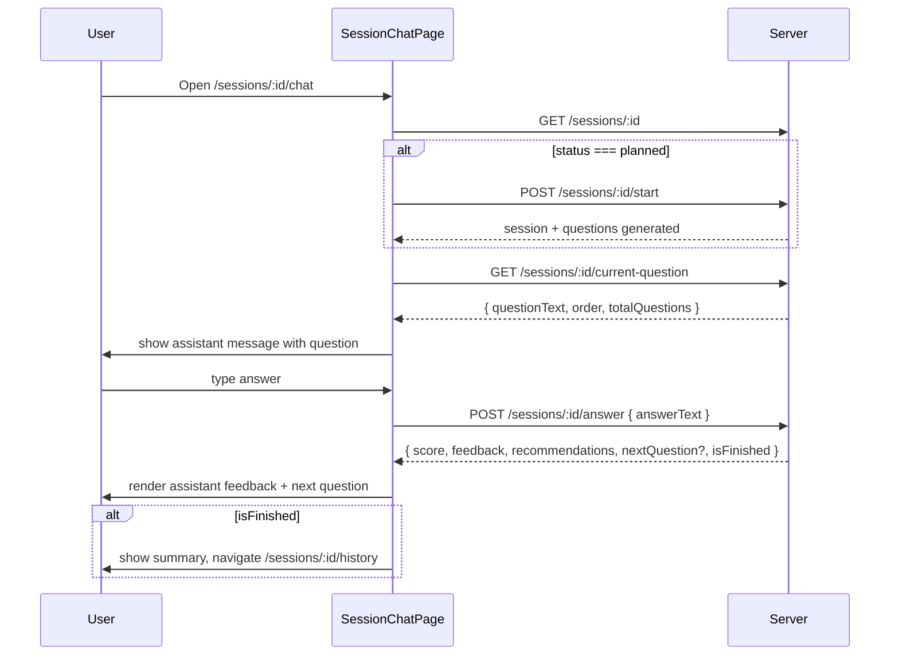
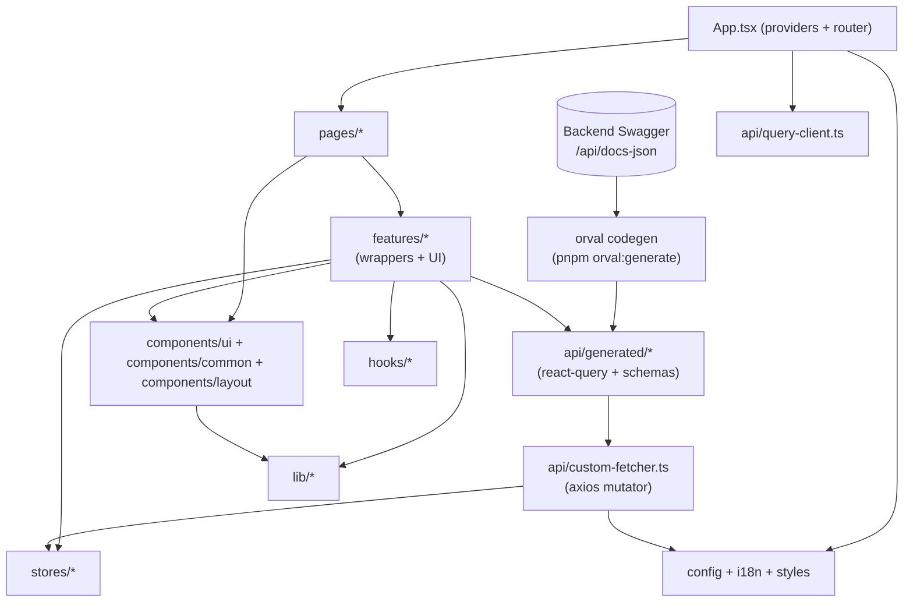
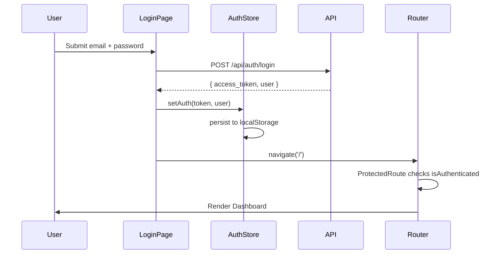
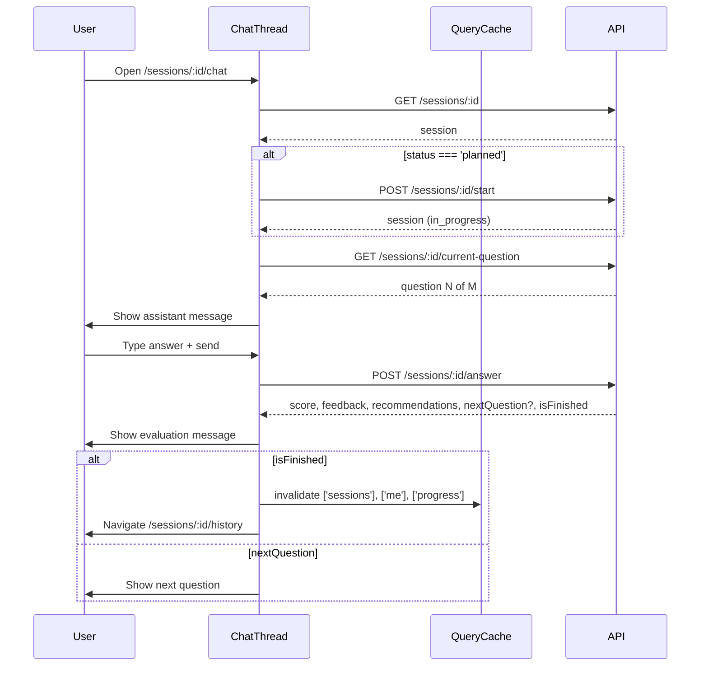
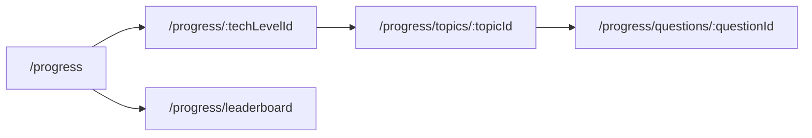

# Frontend Development Roadmap — onBoard

> Полный roadmap для переписки фронтенда onBoard с нуля: от сноса чернового SPA до production-ready приложения со стандартной структурой React + Vite, shadcn-дизайн-системой и интеграцией со всеми 25 реализованными бэкенд-эндпоинтами.
>
> Источник истины по API: [BACKEND_ROADMAP.md](BACKEND_ROADMAP.md), строки 7-26.

**Статус:** [§6 Фаза 0](#6-фаза-0--снос-и-базовая-настройка) **выполнена** (скелет, зависимости, алиасы, env, тема в `index.css`, orval → `react-query.ts` + `schemas/`, `custom-fetcher`).

---

## 1. Цели и текущее состояние

### Цели

- Полностью функциональный SPA поверх NestJS-бэкенда onBoard.
- Собственная визуальная тема: белый фон, светло-серые поверхности, **салатовый** акцент.
- Дизайн-система на базе [shadcn/ui](https://ui.shadcn.com/) с настройкой цветов под тему.
- 5 основных страниц: Dashboard, Sessions, Session (чат с AI), Progress, Profile.
- Стандартная структура React + Vite (feature-based группировка, без экзотических архитектур).
- Локализация (ru/en), доступность (a11y), адаптивная верстка (mobile-first), performance (code-splitting, prefetch).

### Что сейчас есть (`frontend/`) — после фазы 0

Базовый каркас React 19 + Vite 7; legacy-страницы и самописный API-клиент **удалены**. Дальше — фазы 1+ (shadcn, роутинг, фичи).

- Зависимости из [§2](#2-стек-и-ключевые-решения) (в т.ч. shadcn-стек, orval, i18n, zod) **установлены**.
- Алиас `@/*` в [frontend/vite.config.ts](frontend/vite.config.ts) и [frontend/tsconfig.app.json](frontend/tsconfig.app.json).
- [frontend/src/config/env.ts](frontend/src/config/env.ts), [.env.example](frontend/.env.example).
- [frontend/src/App.tsx](frontend/src/App.tsx) — заглушка; [frontend/src/main.tsx](frontend/src/main.tsx); [frontend/src/styles/index.css](frontend/src/styles/index.css) — Tailwind v4 + токены темы (как в [§3](#3-тема-и-дизайн-система), без отдельного shadcn-init).
- [frontend/src/lib/cn.ts](frontend/src/lib/cn.ts) — `clsx` + `tailwind-merge`.
- [frontend/src/api/custom-fetcher.ts](frontend/src/api/custom-fetcher.ts) — axios mutator для orval; [frontend/src/api/query-client.ts](frontend/src/api/query-client.ts) — `QueryClient`.
- Кодоген: [frontend/orval.config.ts](frontend/orval.config.ts) → [frontend/src/api/generated/react-query.ts](frontend/src/api/generated/react-query.ts) + [frontend/src/api/generated/schemas/](frontend/src/api/generated/schemas/); по желанию закоммичен [frontend/src/api/openapi.json](frontend/src/api/openapi.json) как снимок спеки.
- Скелет папок по [§4](#4-структура-проекта) (без `.gitkeep` — пустые каталоги в git не трекаются, это нормально).
- **Дальше по плану:** shadcn init ([§7](#7-фаза-1--дизайн-система-и-тема)), `auth.store.ts`, провайдеры, роуты.

_Исторически (до сноса):_ черновой SPA с Login/Register/Dashboard, [frontend/src/api/client.ts](frontend/src/api/client.ts), [frontend/src/store/auth.ts](frontend/src/store/auth.ts) — снято; идеи interceptors перенесены в `custom-fetcher.ts`.

### Что переиспользуем

- Идеи из `api/client.ts` (axios instance + interceptor).
- Концепцию Zustand-store для сессии пользователя.
- Настройки TS (`strict: true`, `noUnusedLocals`, `verbatimModuleSyntax`) из [frontend/tsconfig.app.json](frontend/tsconfig.app.json).

### Что полностью сносим

- Все страницы `frontend/src/pages/*`.
- Все ad-hoc-стили (indigo-тема, `bg-gray-900` и т.п.).
- `frontend/src/types/index.ts` — **все API-типы будут генерироваться `orval` из Swagger**, самописных DTO не будет.
- `frontend/src/api/{auth,sessions,technologies}.ts` — **все API-хуки и клиенты будут генерироваться `orval`** (`useLogin`, `useGetSessions` и т.д.), самописных api-модулей не будет.

---

## 2. Стек и ключевые решения

| Категория | Выбор | Обоснование |
|-----------|-------|-------------|
| Сборщик | Vite 7 | Уже стоит, быстрый HMR |
| Framework | React 19 + TypeScript strict | Уже стоит |
| Стили | Tailwind CSS v4 + `@theme inline` | Уже стоит, нативные CSS-переменные, без `tailwind.config.js` |
| Дизайн-система | shadcn/ui (Radix primitives) | Копирование компонентов → полный контроль над темой |
| Роутер | React Router v6 (data router) | Уже стоит; `createBrowserRouter` + `loader`/`action` паттерны |
| Data-fetching | TanStack Query v5 | Уже стоит; кэш, retry, optimistic updates |
| **API-клиент и типы** | **`orval` — кодогенерация из Swagger/OpenAPI бэкенда** | **Ни одного самописного хука/DTO: `orval` создаёт TanStack Query хуки + типы + zod-схемы из `/api/docs-json`. Source of truth — Swagger NestJS'а.** |
| UI-стейт | Zustand v5 + `persist` middleware | Уже стоит; минимальный boilerplate |
| Формы | react-hook-form + zod | уже стоит rhf, добавим zod + `@hookform/resolvers/zod` |
| Иконки | lucide-react | Стандарт для shadcn |
| Чат | `@assistant-ui/react` + `@assistant-ui/react-ui` + `@assistant-ui/styles` | Готовое решение с поддержкой shadcn-темы |
| Даты | date-fns | Минимальный размер, tree-shakeable |
| i18n | react-i18next + i18next-browser-languagedetector | Де-факто стандарт |
| Уведомления | `sonner` (включен в shadcn) | Лёгкий, accessible |
| Структура | Feature-based, стандартная для React + Vite | Без лишних абстракций, близко к best practices Vite/Next-сообщества |
| Линтеры | ESLint 9 flat config | Уже стоит |
| Dev-tools | `@tanstack/react-query-devtools`, React DevTools | Отладка |

### Новые зависимости (установлены в фазе 0)

```bash
# shadcn core deps
pnpm add class-variance-authority clsx tailwind-merge tw-animate-css
pnpm add @radix-ui/react-slot lucide-react
pnpm add sonner

# forms & validation
pnpm add zod @hookform/resolvers

# chat
pnpm add @assistant-ui/react @assistant-ui/react-ui @assistant-ui/styles @assistant-ui/react-markdown

# i18n
pnpm add react-i18next i18next i18next-browser-languagedetector

# utils
pnpm add date-fns

# dev
pnpm add -D @tanstack/react-query-devtools

# API codegen (orval)
pnpm add -D orval
# peer-tools для zod-схем (orval поддерживает генерацию zod-валидаторов запросов/ответов)
pnpm add -D openapi-typescript
```

---

## 3. Тема и дизайн-система

### Состояния компонентов (стандарты)

- **hover**: фон `accent`, текст `accent-foreground`.
- **focus**: outline none + `ring-2 ring-ring ring-offset-2 ring-offset-background`.
- **disabled**: `opacity-50 cursor-not-allowed pointer-events-none`.
- **active/pressed**: `translate-y-[1px]` для кнопок.
- **loading**: заменяем иконку/текст на `<Loader2 className="animate-spin"/>`.

### Иллюстрации пустых состояний

Единый паттерн `<EmptyState icon={...} title={...} description={...} action={...} />` в `src/components/common/empty-state.tsx`. Иконки из `lucide-react` (`Inbox`, `Sparkles`, `TrendingUp`).

---

## 4. Структура проекта

Стандартная feature-based структура React + Vite. Никаких «слоёв с правилами зависимостей» — только здравый смысл: общие штуки в `components/`, `hooks/`, `lib/`, `stores/`, крупные домены — в `features/`, тонкие страницы-роуты — в `pages/`.

```
frontend/src/
  api/                       # API-слой: axios mutator + сгенерированный orval-код
    custom-fetcher.ts        # axios-инстанс + interceptors (mutator `customReactQueryAxios` для orval)
    query-client.ts          # TanStack QueryClient + defaults
    openapi.json             # опционально: снимок OpenAPI (если коммитим)
    generated/               # ! ГЕНЕРИРУЕТСЯ orval, НЕ РЕДАКТИРУЕТСЯ ВРУЧНУЮ
      react-query.ts         # единый файл: хуки use* (TanStack Query) + функции API
      schemas/               # TypeScript-типы/параметры по схемам Swagger
        index.ts
        …                    # *Params, *Dto, …
      # zod.ts — отдельный target в orval, только если включите (фаза 3+ форм)

  components/
    ui/                      # shadcn-компоненты (Button, Card, Dialog, ...)
    layout/
      AppLayout.tsx          # обёртка авторизованной зоны (Sidebar + Topbar)
      AuthLayout.tsx         # центрированная карточка для login/register
      Sidebar.tsx
      Topbar.tsx
      LanguageSwitcher.tsx
      UserMenu.tsx
      ProtectedRoute.tsx     # guard для авторизованных роутов
      PublicRoute.tsx        # guard для /login, /register
    common/                  # переиспользуемые prezentational компоненты
      EmptyState.tsx
      PageHeader.tsx
      StatCard.tsx
      ScoreBadge.tsx
      LeagueBadge.tsx
      UserAvatar.tsx
      ErrorBoundary.tsx
      SkeletonList.tsx

  features/                  # крупные доменные блоки
    auth/
      components/
        LoginForm.tsx
        RegisterForm.tsx
      hooks/
        useLogin.ts
        useRegister.ts
      schemas.ts             # zod-схемы
    dashboard/
      components/
        ContinueOrStartWidget.tsx
        StartSessionDialog.tsx
        RecentQuestionsWidget.tsx
        LeagueTopWidget.tsx
        MyTopTechnologiesWidget.tsx
        FavoritesWidget.tsx
      hooks/
        useStartSession.ts      # wrapper: create → start → navigate
    sessions/
      components/
        SessionCard.tsx
        SessionStatusBadge.tsx
        SessionsTabs.tsx
      hooks/
        useSessionActions.ts    # wrapper: abandon/finish/start + invalidate + toast
    session-chat/
      components/
        ChatThread.tsx
        ChatAssistantMessage.tsx
        ChatUserMessage.tsx
        ChatEvaluationMessage.tsx
        SessionControlPanel.tsx
      hooks/
        useChatRuntime.ts       # assistant-ui runtime поверх orval-хуков
        useAnswerQuestion.ts    # wrapper: useSessionsControllerAnswer + invalidate
        useSkipQuestion.ts      # wrapper: useSessionsControllerSkip + invalidate
    progress/
      components/
        TechnologyCard.tsx
        TopicCard.tsx
        QuestionProgressRow.tsx
        QuestionHistoryView.tsx
        LeaderboardTable.tsx
      # собственных хуков нет — зовём useUsersControllerGetProgress/TopicProgress/... напрямую
    profile/
      components/
        ProfileHeader.tsx
        ProfileInfoCard.tsx
        RecentSessionsCard.tsx
        StatsCard.tsx
        EditProfileDialog.tsx     # backend-ext → useUsersControllerUpdateProfile
        ChangeAvatarDialog.tsx    # backend-ext → useUsersControllerUploadAvatar
        ChangePasswordDialog.tsx  # backend-ext → useUsersControllerChangePassword
      # для чтения профиля — useUsersControllerGetProfile() напрямую
    favorites/
      stores/
        favorites.store.ts    # localStorage-fallback в MVP
      hooks/
        useFavorites.ts       # до backend-ext — чтение из store; после — useUsersControllerGetFavorites
        useToggleFavorite.ts  # до backend-ext — в store; после — optimistic update + orval mutation

  pages/                     # тонкие route-компоненты, только композиция
    LoginPage.tsx
    RegisterPage.tsx
    DashboardPage.tsx
    SessionsPage.tsx
    SessionChatPage.tsx
    SessionHistoryPage.tsx
    ProgressPage.tsx
    ProgressTopicsPage.tsx
    ProgressQuestionsPage.tsx
    QuestionHistoryPage.tsx
    LeaderboardPage.tsx
    ProfilePage.tsx
    NotFoundPage.tsx

  routes/
    router.tsx               # createBrowserRouter + lazy imports
    routes.ts                # константы путей ROUTES.DASHBOARD = '/' и т.д.

  stores/
    auth.store.ts            # токен + пользователь + persist

  hooks/                     # общеприкладные хуки
    useDebounce.ts
    useMediaQuery.ts
    useApiError.ts

  lib/
    cn.ts                    # clsx + tailwind-merge
    localize.ts              # выбор { ru, en } полей
    format-score.ts
    format-date.ts
    avatar.ts                # initials + color-hash
    feature-flags.ts

  providers/
    AppProviders.tsx         # композиция всех провайдеров
    QueryProvider.tsx
    I18nProvider.tsx

  i18n/
    index.ts                 # i18next init
    locales/
      ru.json
      en.json

  config/
    env.ts                   # типизированный доступ к import.meta.env

  types/
    common.ts                # Pagination, ApiError, Locale и пр.

  styles/
    index.css                # импорты tailwind + тема

  App.tsx                    # <AppProviders><RouterProvider /></AppProviders>
  main.tsx                   # createRoot + <App />

frontend/
  orval.config.ts            # конфиг orval (живой URL `http://localhost:3000/api/docs-json` или локальный spec)
```

### Соглашения

- **Алиас `@/*` → `src/*`** (настраивается в `vite.config.ts` и `tsconfig.app.json`).
- Импортируем явно: `import { Button } from '@/components/ui/button'`, `import { useAuthControllerLogin, … } from '@/api/generated/react-query'`.
- Файлы UI-компонентов — PascalCase (`SessionCard.tsx`); хуки, утилиты, сторы — camelCase (`auth.store.ts`).
- Один компонент — один файл; сложные композиции разбиваем на `components/` подпапку фичи.
- Если компонент используется более чем в одной фиче → переезжает в `components/common/`.
- **API-слой (`src/api/generated/*`) полностью генерируется** — ручные правки запрещены; перегенерация: `pnpm orval:generate` (или `pnpm api:gen:watch`). Hand-written: `src/api/custom-fetcher.ts`, `query-client.ts`.
- **ESLint** игнорирует `src/api/generated` (flat config). **Prettier** не должен полностью игнорировать `src/api/generated/`, иначе не отформатируется сгенерированный код; формат при codegen задаёт orval: `output.formatter: 'prettier'` (orval v8).
- **Бизнес-хуки** (`features/*/hooks/useXxx.ts`) — это **тонкие обёртки** над сгенерированными orval-хуками: добавляют `onSuccess`-колбэки (навигация, invalidation, toast), объединяют несколько вызовов или предоставляют default-аргументы. Сырые orval-хуки можно звать и напрямую из компонентов, если бизнес-логики нет.
- Типы API (`User`, `Session`, `InterviewAnswer` и т.п.) — только из `@/api/generated/schemas`, вручную DTO не пишем.

### 4.1 Конфигурация orval (фактическое состояние)

`frontend/orval.config.ts` — проект `reactQuery`, **один** выходной файл + `schemas/`:

```ts
import { defineConfig } from 'orval';

export default defineConfig({
  reactQuery: {
    input: {
      target: 'http://localhost:3000/api/docs-json', // бэк на :3000; спека должна быть валидна для OAS 3.0
    },
    output: {
      mode: 'single',
      target: 'src/api/generated/react-query.ts',
      schemas: 'src/api/generated/schemas',
      client: 'react-query',
      httpClient: 'axios',
      clean: true,
      formatter: 'prettier', // orval v8: встроенное форматирование (peer `prettier`), не `prettier: true`
      override: {
        mutator: {
          path: 'src/api/custom-fetcher.ts',
          name: 'customReactQueryAxios',
        },
        query: {
          useQuery: true,
          useMutation: true,
          useInfinite: false, // `useInfiniteQueryParam: 'skip'` отключён: orval v8 иначе ломал типы на get-by-id
          signal: true,
        },
      },
    },
  },
});
```

**Скрипты в `frontend/package.json`:**

```jsonc
{
  "scripts": {
    "orval:generate": "orval --config orval.config.ts",
    "api:gen:watch": "orval --watch --config orval.config.ts",
    "dev": "vite",
    "build": "tsc -b && vite build"
  }
}
```

Перед `pnpm orval:generate` нужен **запущенный** Nest (или иной источник `input.target`). Примечание: при `clean: true` **не** держите второй orval-target с `clean: true` в той же папке `generated/`, иначе один target сотрёт вывод другого. Отдельный `client: 'zod'` (файл `zod.ts`) — опционально, в фазе 3+ для форм.

**Ограничения orval v8:** валидация OpenAPI выполняется **до** `input.override.transformer`; костыли в DTO (например `examples` вместо `example` в OAS 3.0) правятся в NestJS, не в orval.

**Требования к бэкенду для полноценной генерации**:

- Swagger уже поднят на `http://localhost:3000/api/docs` (см. [AGENTS.md](AGENTS.md)). JSON-схема доступна по `http://localhost:3000/api/docs-json`.
- Каждый эндпоинт должен иметь **`@ApiOperation`** и **`@ApiResponse`** с типизированным DTO (не просто `any`/объект). Это задача бэкенда — она вынесена в чек-лист «Координация фронт/бэк» (раздел 16).
- `operationId`-ы должны быть стабильны между версиями (NestJS по умолчанию генерирует их как `<controller>_<method>` — достаточно для orval).

**Контроль целостности в CI** (когда настроите pipeline):

- `pnpm orval:generate && git diff --exit-code src/api/generated` — при смене контракта без перегенерации дифф будет ненулевой.

---

## 5. Карта эндпоинтов → файлам

Все 25 эндпоинтов из [BACKEND_ROADMAP.md](BACKEND_ROADMAP.md) (строки 7-26). Хуки **генерируются orval** из Swagger; имена ниже приблизительные (точные имена определит `operationId` в NestJS-декораторах). Wrapper — это тонкий хук в `features/`, оборачивающий генерированный: добавляет навигацию, invalidation, toast.

### Auth

| Endpoint | Генерированный хук | Wrapper (если нужен) |
|----------|--------------------|----------------------|
| `GET /api/health` | `useAppControllerHealth()` | — |
| `POST /api/auth/register` | `useAuthControllerRegister()` | `features/auth/hooks/useRegister.ts` (добавляет `setAuth` + navigate) |
| `POST /api/auth/login` | `useAuthControllerLogin()` | `features/auth/hooks/useLogin.ts` (то же) |

### Справочники

| Endpoint | Генерированный хук | Используется в |
|----------|--------------------|----------------|
| `GET /api/technologies` | `useTechnologiesControllerFindAll()` | `StartSessionDialog`, `ProgressPage` |
| `GET /api/technologies/:id` | `useTechnologiesControllerFindOne(id)` | по месту |
| `GET /api/topics?levelId` | `useTopicsControllerFindAll({ levelId })` | `ProgressTopicsPage` |
| `GET /api/topics/:id` | `useTopicsControllerFindOne(id)` | по месту |
| `GET /api/questions?topicId` | `useQuestionsControllerFindAll({ topicId })` | `ProgressQuestionsPage` |
| `GET /api/questions/:id` | `useQuestionsControllerFindOne(id)` | `FavoritesWidget` |

### Пользователи и прогресс

| Endpoint | Генерированный хук | Используется в |
|----------|--------------------|----------------|
| `GET /api/users/me` | `useUsersControllerGetProfile()` | `ProfileHeader`, topbar, guards |
| `GET /api/users` | `useUsersControllerFindAll()` + infinite-вариант | `LeaderboardPage` |
| `GET /api/users/me/progress` | `useUsersControllerGetProgress()` | `ProgressPage`, `MyTopTechnologiesWidget` |
| `GET /api/users/me/progress/topics?technologyLevelId` | `useUsersControllerGetTopicProgress({ technologyLevelId })` | `ProgressTopicsPage` |
| `GET /api/users/me/progress/questions?topicId` | `useUsersControllerGetQuestionProgress({ topicId })` | `ProgressQuestionsPage` |
| `GET /api/users/me/questions/:questionId/history` | `useUsersControllerGetQuestionAnswerHistory(questionId)` | `QuestionHistoryPage` |

### Сессии

| Endpoint | Генерированный хук | Wrapper (если нужен) |
|----------|--------------------|----------------------|
| `POST /api/sessions` | `useSessionsControllerCreate()` | `features/dashboard/hooks/useStartSession.ts` (`create → start → navigate`) |
| `GET /api/sessions` | `useSessionsControllerFindAll()` (infinite) | `SessionsTabs` использует напрямую |
| `GET /api/sessions/:id` | `useSessionsControllerFindOne(id)` | напрямую |
| `POST /api/sessions/:id/start` | `useSessionsControllerStart()` | входит в `useStartSession` |
| `GET /api/sessions/:id/current-question` | `useSessionsControllerGetCurrentQuestion(id)` | `features/session-chat/hooks/useChatRuntime` |
| `POST /api/sessions/:id/skip` | `useSessionsControllerSkip()` | `features/session-chat/hooks/useSkipQuestion.ts` (+ invalidate) |
| `POST /api/sessions/:id/answer` | `useSessionsControllerAnswer()` | `features/session-chat/hooks/useAnswerQuestion.ts` (+ invalidate) |
| `POST /api/sessions/:id/finish` | `useSessionsControllerFinish()` | `features/sessions/hooks/useSessionActions.ts` |
| `POST /api/sessions/:id/abandon` | `useSessionsControllerAbandon()` | `features/sessions/hooks/useSessionActions.ts` |

### Страницы → композиция

| Страница (роут) | Файл | Использует |
|-----------------|------|------------|
| `/` | `pages/DashboardPage.tsx` | `features/dashboard/*` |
| `/sessions` | `pages/SessionsPage.tsx` | `features/sessions/*` |
| `/sessions/:id/chat` | `pages/SessionChatPage.tsx` | `features/session-chat/*` |
| `/sessions/:id/history` | `pages/SessionHistoryPage.tsx` | `features/session-chat/components/ChatThread` (read-only mode) |
| `/progress` | `pages/ProgressPage.tsx` | `features/progress/components/TechnologyCard` |
| `/progress/:techLevelId` | `pages/ProgressTopicsPage.tsx` | `features/progress/components/TopicCard` |
| `/progress/topics/:topicId` | `pages/ProgressQuestionsPage.tsx` | `features/progress/components/QuestionProgressRow` |
| `/progress/questions/:questionId` | `pages/QuestionHistoryPage.tsx` | `features/progress/components/QuestionHistoryView` |
| `/progress/leaderboard` | `pages/LeaderboardPage.tsx` | `features/progress/components/LeaderboardTable` |
| `/profile` | `pages/ProfilePage.tsx` | `features/profile/*` |
| `/login`, `/register` | `pages/LoginPage.tsx`, `pages/RegisterPage.tsx` | `features/auth/*` |

---

## 6. Фаза 0 — Снос и базовая настройка - DONE

**Цель**: чистый скелет проекта со стандартной структурой, готовый принимать фичи.

**Статус: выполнено** (код в репозитории соответствует; коммит с подходящим сообщением — на усмотрение).

### Шаги

1. [x] Удалить содержимое `frontend/src/` кроме `main.tsx` и `assets/`.
2. [x] Сформировать скелет папок (см. [§4](#4-структура-проекта)). ~~В каждой папке — `.gitkeep`~~ — от **не** используем: пустые каталоги в git не нужны; по мере фич папки заполнятся файлами.
3. [x] Установить новые зависимости (см. [§2](#2-стек-и-ключевые-решения)), включая `orval`, `prettier` (для `formatter: 'prettier'`), `openapi-typescript` (dev).
4. [x] Настроить алиасы в [frontend/vite.config.ts](frontend/vite.config.ts) и [frontend/tsconfig.app.json](frontend/tsconfig.app.json) (`@/*` → `src/*`).
5. [x] [frontend/.env.example](frontend/.env.example) и [frontend/src/config/env.ts](frontend/src/config/env.ts) с полями `apiBaseUrl`, `defaultLang`, `enableFavoritesApi`, `enableAvatarUpload`.
6. [x] Базовые файлы: [frontend/src/App.tsx](frontend/src/App.tsx) (заглушка), [frontend/src/main.tsx](frontend/src/main.tsx), [frontend/src/styles/index.css](frontend/src/styles/index.css) — не только `tailwindcss`, а **тема** по сниппету [§3](#3-тема-и-дизайн-система) (ближе к будущему shadcn).
7. [x] [frontend/src/lib/cn.ts](frontend/src/lib/cn.ts) для проверки алиаса `@/lib/cn`.
8. [x] Smoke: `pnpm dev` — белая страница с «Hello onBoard».
9. [x] orval: [frontend/orval.config.ts](frontend/orval.config.ts), [frontend/src/api/custom-fetcher.ts](frontend/src/api/custom-fetcher.ts) (mutator `customReactQueryAxios`, не `http.ts` / `customHttp`), [frontend/src/api/query-client.ts](frontend/src/api/query-client.ts); бэк на `http://localhost:3000` для `docs-json`. Генерация: `pnpm orval:generate` → [frontend/src/api/generated/react-query.ts](frontend/src/api/generated/react-query.ts) + [schemas/](frontend/src/api/generated/schemas/).
10. [x] Сгенерированный код **в git** (не в `.gitignore`); `src/api/generated` **в** [eslint `globalIgnores`](frontend/eslint.config.js); для Prettier **не** игнорировать целиком `src/api/generated` (см. [`.prettierignore`](frontend/.prettierignore) — оставлены комментарии, без массового `src/api/generated/`), иначе `output.formatter: 'prettier'` / ручной prettier не трогает codegen.
11. [x] Скрипты: `orval:generate`, `api:gen:watch` ([package.json](frontend/package.json)). `dev` / `build` **без** обязательной генерации на каждый старт (ускоряет dev; CI может вызывать `orval:generate` отдельно).
12. [ ] Git-commit `chore(frontend): teardown legacy SPA, scaffold new structure with orval` — при необходимости выполнить локально.

### Критерий готовности

- [x] `pnpm build` и `pnpm lint` проходят без ошибок.
- [x] Структура папок по схеме [§4](#4-структура-проекта) (скелет; сами **файлы** вроде `EmptyState.tsx` — в следующих фазах).
- [x] `import '@/lib/cn'` резолвится.
- [x] `pnpm orval:generate` (при поднятом бэке) обновляет `src/api/generated/react-query.ts` и `schemas/`.
- [x] `import { … } from '@/api/generated/react-query'` (актуальные имена хуков смотреть в файле) резолвится в TS.

---

## 7. Фаза 1 — Дизайн-система и тема - DONE

**Цель**: готовый набор shadcn-компонентов, c актуализацией темы под видение дизайна. Дизайн - компонентная база на основе shadcn, базовые компоненты с эффектом матового стекла, с легким ацкентным фоном (салатовый) или рамками.

### Шаги

1. Сверить `frontend/src/styles/index.css` с разделом 3 (после фазы 0 файл уже с Tailwind + токенами; при `shadcn init` пути и импорты могут обновиться).
2. Инициализировать shadcn
3. Проверить, что `components.json` выставил корректные пути (`@/components/ui`, `@/lib/cn`).
4. Сгенерировать компоненты (будут лежать в `src/components/ui/`):
   ```bash
   pnpm dlx shadcn@latest add button card input label textarea form \
     dialog sheet tabs badge avatar progress skeleton dropdown-menu \
     command separator scroll-area tooltip select sonner alert \
     accordion
   ```
5. Серьезный раздел - необходимо кастомизирвоать каждый компонент, используя общий, понятный подход. Добавить эффект матового стекла, далее синтегрировать стекло с акцентным цветом. Переопределить токены салатового в `index.css` (см. раздел 3). Доп. пожелания - карточки без рамок (играем фоном).
6. Создать кастомные композиции:
   - `src/components/common/EmptyState.tsx`
   - `src/components/common/PageHeader.tsx`
   - `src/components/common/StatCard.tsx`
   - `src/components/common/ScoreBadge.tsx`
   - `src/components/common/LeagueBadge.tsx`
   - `src/components/common/UserAvatar.tsx` (инициалы + цвет по hash'у username)
   - `src/components/common/SkeletonList.tsx`
7. Создать dev-страницу витрины `/ui-kit` (доступна по `env.showUiKit` или только в dev) — показывает все базовые и кастомные компоненты в теме.
8. Commit `feat(frontend): shadcn design system with salad-green theme`.

### Критерий готовности

- На витрине отображаются все 20+ компонентов с салатовым акцентом.
- Контраст (WCAG AA) проверен для `primary` + `primary-foreground`.

---

## 8. Фаза 2 — Базовый каркас приложения - DONE

**Цель**: работающий роутинг с layout'ами, providers, i18n, error boundary.

### 8.1 Providers ✅

`src/providers/AppProviders.tsx` — порядок обёрток: `QueryClientProvider` → `I18nextProvider` → `ErrorBoundary` → `children` + `Toaster` + `ReactQueryDevtools` (только в `import.meta.env.DEV`).

```tsx
export function AppProviders({ children }: { children: ReactNode }) {
  return (
    <QueryClientProvider client={queryClient}>
      <I18nextProvider i18n={i18n}>
        <ErrorBoundary>
          {children}
          <Toaster richColors position="top-right" />
          {import.meta.env.DEV && <ReactQueryDevtools initialIsOpen={false} />}
        </ErrorBoundary>
      </I18nextProvider>
    </QueryClientProvider>
  );
}
```

`src/main.tsx` — `import '@/i18n'` добавлен сразу после импорта стилей (до `App`), чтобы i18next инициализировался до первого `useTranslation()`.

`src/App.tsx`:
```tsx
export default function App() {
  return (
    <AppProviders>
      <RouterProvider router={router} />
    </AppProviders>
  );
}
```

### 8.2 QueryClient ✅

`src/api/query-client.ts` — `staleTime: 30s`, `gcTime: 5min`, `retry` пропускает 401, `refetchOnWindowFocus: false`.

### 8.3 HTTP — axios mutator для orval ✅

`src/api/custom-fetcher.ts` — реализован и используется в `orval.config.ts` как mutator `customReactQueryAxios`. Перехватчики: Bearer-токен из `useAuthStore`, заголовок `Accept-Language` из `i18n.resolvedLanguage`, редирект на `/login` при 401.

Переименование в `http.ts` / `customHttp` — отложено до Фазы 3 при необходимости.

### 8.4 Router (data router) ✅

`src/routes/router.tsx` — `createBrowserRouter` с 13 страницами (lazy) + `/404` + wildcard `*→/404`. UI Kit доступен по `/ui-kit` под флагом `import.meta.env.DEV || env.showUiKit`.

`src/routes/routes.ts` — объект `ROUTES` с функциями для параметризованных путей.

### 8.5 Layouts и guards ✅

- `AuthLayout` — лого + `LanguageSwitcher` в хедере, `<Outlet>` центрирован в `max-w-sm`.
- `AppLayout` — `Sidebar` (фикс. 240px, Sheet на `<lg`) + `Topbar` + `<main>`.
- `Topbar` — sticky glass-хедер `h-14`. Слева заголовок раздела через `getRouteTitleKey(pathname)` (`startsWith`-матчинг: `/progress/leaderboard` → `nav.leaderboard`, `/progress` → `nav.progress`, `/sessions` → `nav.sessions`, `/profile` → `nav.profile`, иначе `nav.dashboard`). Справа `LanguageSwitcher` + `UserMenu`.
- `ProtectedRoute` — `isAuthenticated()` из `useAuthStore`, при `false` → `<Navigate to="/login">`.
- `PublicRoute` — при `isAuthenticated()` → `<Navigate to="/">`.

**Замечание:** `DropdownMenuLabel` (`MenuPrimitive.GroupLabel` из Base UI) требует обёртки `DropdownMenuGroup` — исправлено в `LanguageSwitcher` и `UserMenu`.

### 8.6 i18n ✅

`src/i18n/index.ts` — `LanguageDetector` + `initReactI18next`, `fallbackLng` из `env.defaultLang`, детект из `localStorage` (`i18nextLng`). Локали `ru.json` / `en.json` содержат ключи: `app`, `nav`, `auth`, `user`, `language`, `errors`, `common`.

### 8.7 Error boundary ✅

`src/components/common/ErrorBoundary.tsx` — class-component, обёрнут `withTranslation()`. Показывает `EmptyState` с кнопкой «Перезагрузить». Логи: `console.error` + `sonner.toast.error`.

### 8.8 Страницы-заглушки ✅

`src/components/common/WipPage.tsx` — общий helper с `EmptyState` + иконкой `Construction`. Принимает `titleKey` / `descriptionKey` (дефолты: `common.comingSoon` / `common.wipDescription`).

Реализованные страницы:
- `LoginPage` — `Card` с кнопкой «Войти как dev» (вызывает `useAuthStore.setAuth` со стабом + `navigate('/')`), ссылка на `/register`.
- `RegisterPage` — `Card` со ссылкой обратно на `/login`.
- `NotFoundPage` — `EmptyState` с иконкой `Compass` + кнопка «На главную».
- `DashboardPage`, `SessionsPage`, `SessionChatPage`, `SessionHistoryPage`, `ProgressPage`, `ProgressTopicsPage`, `ProgressQuestionsPage`, `QuestionHistoryPage`, `LeaderboardPage`, `ProfilePage` — `WipPage` с соответствующим `titleKey`.

### Критерий готовности ✅

- 13 маршрутов зарегистрированы, lazy-loading работает (Vite выдаёт отдельные чанки для каждой страницы).
- `pnpm lint` и `pnpm build` — зелёные без ошибок TS.
- Переключение ru/en в `Topbar` меняет UI без перезагрузки, `localStorage.i18nextLng` обновляется.
- Sidebar адаптивный (mobile → Sheet).
- `/ui-kit` доступен под dev-флагом.

---

## 9. Фаза 3 — Auth ✅

**Цель**: зарегистрировались → залогинились → попали на `/`.

### 9.1 Backend: типизация ответа

Добавлены два DTO чтобы orval мог сгенерировать строгий тип ответа (вместо `void`):

- `backend/src/auth/dto/user-public.dto.ts` — `UserPublicDto { id, email, username }`
- `backend/src/auth/dto/auth-response.dto.ts` — `AuthResponseDto { access_token, user: UserPublicDto }`

Эндпоинты декорированы `@ApiCreatedResponse` / `@ApiOkResponse`. После `pnpm run orval:generate` из фронта появляются `authResponseDto.ts` и `userPublicDto.ts` в `src/api/generated/schemas/`.

### 9.2 Auth store

`src/stores/auth.store.ts` — **уже был реализован** в рамках Фазы 2. Ключевые детали фактической реализации:

```ts
export type AuthUser = {
  id: string;
  username: string;
  email?: string; // опциональный — совместим с обязательным email из бэка
};

type AuthState = {
  token: string | null;
  user: AuthUser | null;
  setAuth: (payload: { token: string; user: AuthUser }) => void; // объект, не позиционные аргументы
  setUser: (user: AuthUser | null) => void;
  logout: () => void;
  isAuthenticated: () => boolean;
};
```

Persist-ключ: `'onboard-auth'` (в localStorage). `partialize` сохраняет только `{ token, user }`.

> `AuthUser` — локальный тип, а не `User` из generated-схем: у бэка нет отдельного GET /users/me endpoint с `@ApiOkResponse` на данном этапе. Когда появится — заменить на `import type { UserPublicDto } from '@/api/generated/schemas'`.

### 9.3 Бизнес-хуки поверх orval

**Никаких самописных api-модулей** — логинимся через сгенерированный `useAuthControllerLogin()`. Wrapper только добавляет эффекты:

```ts
// src/features/auth/hooks/useLogin.ts
export function useLogin() {
  const setAuth = useAuthStore((s) => s.setAuth);
  const navigate = useNavigate();

  return useAuthControllerLogin({
    mutation: {
      onSuccess: ({ access_token, user }) => {
        setAuth({ token: access_token, user }); // объектная форма setAuth
        queryClient.setQueryData(['/users/me'], user);
        void navigate(ROUTES.DASHBOARD, { replace: true });
      },
      onError: (err) => toast.error(getApiErrorMessage(err)),
    },
  });
}
```

Аналогично `useRegister.ts` — оборачивает `useAuthControllerRegister()`. Оба хука типизированы через `AuthResponseDto` из сгенерированных схем.

Использование в `LoginForm`:

```tsx
const { mutate, isPending } = useLogin();
const onSubmit = (values: LoginInput) => mutate({ data: values });
```

> `{ data: values }` — стандартный wrapper orval для body-мутаций.

### 9.4 Утилита ошибок

`src/lib/api-error.ts` — `getApiErrorMessage(error)` маппит HTTP-статусы на i18n-ключи:

| Статус | i18n-ключ |
|--------|-----------|
| 401 | `errors.api.invalidCredentials` |
| 409 | `errors.api.emailTaken` |
| 400 | `errors.api.badRequest` (или `response.data.message`) |
| иначе | `errors.api.unknown` |

### 9.5 Формы

**shadcn Form** добавлен вручную: `src/components/ui/form.tsx` — `Form`, `FormField`, `FormItem`, `FormLabel`, `FormControl`, `FormMessage`. Использует `react-hook-form` `Controller` + `@radix-ui/react-slot`.

Zod-схемы в `src/features/auth/schemas.ts` — самописные (orval-target `client: 'zod'` не добавлен). Сообщения об ошибках хранят i18n-ключи, переводятся в компоненте через `t(fieldState.error.message)`:

```ts
export const loginSchema = z.object({
  email: z.string().email('errors.form.email'),
  password: z.string().min(1, 'errors.form.passwordRequired'),
});

export const registerSchema = z.object({
  email: z.string().email('errors.form.email'),
  password: z.string().min(6, 'errors.form.passwordMin'),
  username: z.string().min(2, 'errors.form.usernameMin'),
});
```

Ограничения `min(6)` / `min(2)` зеркалят `@MinLength` на бэке — если бэк изменится, менять нужно оба места. Когда появится orval zod-target — заменить на сгенерированные схемы.

`LoginForm.tsx` / `RegisterForm.tsx` — `useForm` + `zodResolver` + shadcn `<Form>` + shadcn `<Input>` / `<Button>`.

### 9.6 Страницы

`pages/LoginPage.tsx`, `pages/RegisterPage.tsx` — тонкие, рендерят форму внутри `<Card>`. `AuthLayout` (обёрнут в `PublicRoute` в роутере) не изменялся.

### 9.7 HTTP-слой: исправления и улучшения

**`src/api/custom-fetcher.ts`**:
- Response-interceptor при `401`: если URL не является auth-эндпоинтом (`/api/auth/login`, `/api/auth/register`) — `logout()` + `toast.error(t('errors.api.sessionExpired'))` + редирект на `/login`. На auth-эндпоинтах 401 — обычная ошибка валидации, обрабатывается в `useLogin.onError`.

**`src/config/env.ts`**:
- `apiBaseUrl` изменён с `'/api'` на `''`. Причина: orval генерирует URL как `/api/auth/login` (полный путь), а Vite proxy `/api → http://localhost:3000` сохраняет путь без rewrite. `baseURL='/api'` давал двойной префикс `/api/api/...`.

**`src/i18n/locales/{ru,en}.json`** — добавлены ключи:
- `auth.{email,password,username,emailPlaceholder,passwordPlaceholder,usernamePlaceholder,submitLogin,submitRegister,submitting}`
- `errors.api.{invalidCredentials,emailTaken,badRequest,sessionExpired,unknown}`
- `errors.form.{email,passwordRequired,passwordMin,usernameRequired,usernameMin}`

### Критерий готовности ✅

- Регистрация → автологин → редирект на `/`.
- Logout из Topbar user-menu → редирект `/login`, state сохраняется в localStorage под ключом `onboard-auth`.
- 401 от любого не-auth API → auto-logout + toast «Сеанс истёк» + редирект на `/login`.

---

## 10. Фаза 4 — Dashboard ✅

**Цель**: страница `/` с 5 виджетами-плитками.

### 10.1 Backend: типизация API-эндпоинтов

Добавлены `@ApiOkResponse` / `@ApiCreatedResponse` декораторы и созданы DTO-классы для всех эндпоинтов Dashboard. Orval теперь генерирует строго типизированные DTO.

Созданные DTO:
- `backend/src/users/dto/user-me.dto.ts` — `UserMeDto { id, email, username, fullScore, league, createdAt }`
- `backend/src/users/dto/user-leaderboard-item.dto.ts` — `UserLeaderboardItemDto { id, username, fullScore, league }`
- `backend/src/users/dto/user-progress.dto.ts` — `UserProgressTechnologyDto`, `UserProgressLevelDto`, `UserProgressTopicDto`
- `backend/src/sessions/dto/session.dto.ts` — `SessionDto` (список) с вложенным `SessionTechnologyLevelDto` / `SessionTechnologyDto`
- `backend/src/sessions/dto/session-detail.dto.ts` — `SessionDetailDto extends SessionDto` + `SessionQuestionDto` + `SessionAnswerDto`
- `backend/src/technologies/dto/technology.dto.ts` — `TechnologyDto` + `TechnologyLevelDto`
- `backend/src/questions/dto/question-detail.dto.ts` — `QuestionDetailDto`
- `backend/src/ai/dto/ai-providers.dto.ts` — `AiProvidersDto` + `AiProviderDto`

Декорированы контроллеры: `users`, `sessions`, `technologies`, `questions`, `ai`.

### 10.2 Frontend: slider + favorites

- `@radix-ui/react-slider` установлен; обёртка `src/components/ui/slider.tsx` по шаблону shadcn.
- `features/favorites/stores/favorites.store.ts` — Zustand + `persist` (ключ `onboard-favorites`). Хранит `ids: string[]`; actions: `add`, `remove`, `toggle`, `has`.
- `features/favorites/hooks/useFavoriteIds.ts` — селектор `ids`.
- `features/favorites/hooks/useToggleFavorite.ts` — `{ isFavorite, toggle }` для одного id.

### 10.3 Widget: Continue / Start (hero)

`features/dashboard/components/ContinueOrStartWidget.tsx`:
- `useSessionsControllerFindAll({ take: 50 })` → клиентский фильтр `status === 'in_progress'`, берём первый.
- Есть активная сессия → название технологии + уровень + `<Progress value={currentOrder/totalQuestions*100}/>` + кнопка «Продолжить» → `ROUTES.SESSION_CHAT(id)`.
- Нет активной → кнопка «Начать новую сессию» → открывает `<StartSessionDialog>`.

`features/dashboard/components/StartSessionDialog.tsx` (shadcn `<Dialog>` + react-hook-form + zod):
- Select: Технология (`useTechnologiesControllerFindAll()`).
- Select: Уровень — опции из `selectedTechnology.levels`, сбрасывается при смене технологии.
- Slider: Количество вопросов (5–20, шаг 1, default 10) с текущим значением в label.
- Select: Модель AI — `auto` + провайдеры из `useAiControllerGetProviders()`; disabled если `!hasProviders`.
- Submit → `useStartSession.start({ technologyLevelId, questionsCount, model })`.
- Zod-схема: `features/dashboard/schemas.ts` (`startSessionSchema`), i18n-ключи в сообщениях.

`features/dashboard/hooks/useStartSession.ts`:
- `mutateAsync(useSessionsControllerCreate)` → `mutateAsync(useSessionsControllerStart)` → `navigate(ROUTES.SESSION_CHAT(id))`.
- Ошибки: `toast.error(getApiErrorMessage(err))`.

### 10.4 Widget: Recent Questions

`features/dashboard/components/RecentQuestionsWidget.tsx`:
- `useSessionsControllerFindAll({ take: 1 })` → берём последнюю сессию.
- `useSessionsControllerFindOne(id, {}, { query: { enabled: !!id } })` → получаем `questions[]` с `answers[]`.
- 5 последних вопросов по `order` desc, у каждого — `<ScoreBadge score={lastAnswer.score}>`.
- Empty при отсутствии сессий; Error state при ошибке запроса.

### 10.5 Widget: My League Top Players

`features/dashboard/components/LeagueTopWidget.tsx`:
- `useUsersControllerGetProfile()` → `currentUser.league`.
- `useUsersControllerFindAll({ take: 50 })` → filter `user.league === currentUser.league` → `slice(0, 5)`.
- Список: `<UserAvatar>` + username + опциональный Badge «Вы» + `<ScoreBadge score={fullScore}>`.
- Заголовок с `<LeagueBadge league={me.league}>`.

### 10.6 Widget: My Top Technologies

`features/dashboard/components/MyTopTechnologiesWidget.tsx`:
- `useUsersControllerGetProgress()` → `UserProgressTechnologyDto[]`.
- Клиентский расчёт: `totalScore = sum(level.topics[].score)` по каждой технологии, сортировка desc, top 5.
- Строка: имя технологии + `<Progress value={score/maxScore*100}/>` + процент.

### 10.7 Widget: Favorite Questions

`features/dashboard/components/FavoritesWidget.tsx`:
- `useFavoriteIds()` → массив id.
- `useQueries` с `getQuestionsControllerFindOneQueryOptions(id)` для каждого id.
- Каждая строка: `questionText` (line-clamp-1) + `difficulty` + кнопка-крестик (`useToggleFavorite`).
- Empty state: иконка Star + текст.
- Backend-ext: `GET /api/users/me/favorites` → `useUsersControllerGetFavorites()` (подключаем по флагу `env.enableFavoritesApi`, пока `false`). Кнопка «звезда» — в компонентах списков вопросов в фазах 5–7.

### 10.8 DashboardPage + i18n

`pages/DashboardPage.tsx` — `<PageHeader>` + `<ContinueOrStartWidget>` на полную ширину + `grid grid-cols-1 md:grid-cols-2 gap-4` с четырьмя виджетами.

i18n ключи добавлены в `ru.json` и `en.json`:
- `dashboard.{title,description,continue.*,start.*,dialog.*,recentQuestions.*,leagueTop.*,topTechnologies.*,favorites.*}`
- `errors.form.{technologyRequired,levelRequired,modelRequired,questionsCountRange}`
- `league.{bronze,silver,gold,platinum}`

### Критерий готовности ✅

- `pnpm run lint` — 0 ошибок.
- `pnpm run build` — успешная сборка без TS-ошибок.
- Все 5 виджетов рендерятся без ошибок при пустом state (новый пользователь).
- Активная сессия → виджет Continue показывает progress bar.
- `<StartSessionDialog>` — все поля валидируются, submit запускает сессию и редиректит в чат.

---

## 11. Фаза 5 — Sessions ✅

**Цель**: страница `/sessions` со списком и переходом в чат/историю.

### 11.1 Страница

- `<PageHeader>` с кнопкой «Новая сессия» → открывает `<StartSessionDialog>`.
- `<SessionsTabs>` наверху: `Active (N)` / `All (N)`.
  - `N` = `total` из хука (серверная фильтрация `?status=planned,in_progress` / без фильтра).
  - Счётчик отображается только для активного таба.
  - Активный таб выделен светло-зелёным (`--accent`).
- Под tabs — список `<SessionCard>`:
  - Название технологии + уровень (`<Badge>`).
  - `<SessionStatusBadge>`: planned/in_progress/completed/abandoned — разные цвета.
  - Прогресс `currentOrder / totalQuestions`.
  - Дата (`formatDistanceToNow` из `date-fns`), локаль из `i18n.language`.
  - Клик:
    - `planned` → открыть `<StartPlannedDialog>` (confirm) → `POST /sessions/:id/start` → `/sessions/:id/chat`.
    - `in_progress` → `/sessions/:id/chat`.
    - `completed | abandoned` → `/sessions/:id/history`.

### 11.2 Компоненты

| Файл | Описание |
|------|----------|
| `features/sessions/components/SessionCard.tsx` | Карточка сессии |
| `features/sessions/components/SessionStatusBadge.tsx` | Бейдж статуса (4 варианта) |
| `features/sessions/components/SessionsTabs.tsx` | Табы Active / All |
| `features/sessions/components/SessionsList.tsx` | Список + skeleton + empty state + Load more |
| `features/sessions/components/StartSessionDialog.tsx` | Диалог создания сессии (перенесён из dashboard) |
| `features/sessions/components/StartPlannedDialog.tsx` | Confirm-диалог запуска planned-сессии |
| `features/sessions/hooks/useSessionsList.ts` | Хук: фильтрация, пагинация take-based |
| `features/sessions/hooks/useStartSession.ts` | Хук: создание + запуск сессии (перенесён из dashboard) |
| `features/sessions/hooks/useStartPlannedSession.ts` | Хук: запуск existing planned-сессии |

### 11.3 Backend-изменения

- `GET /api/sessions` расширен: `?status=planned,in_progress` (строка через запятую).
- Возвращает `{ items: SessionDto[], total: number }`.
- Сервис: 2 запроса в `$transaction` — `findMany` + `count`.

### 11.4 Пагинация

- `take`-based: начальный `take=20`, кнопка «Загрузить ещё» увеличивает на 20.
- Сброс `take` при смене таба через паттерн derived state (без `useEffect`).

### Фильтры (advanced, фаза 11)

- По технологии (select).
- По статусу (multi-select).
- По дате (date-range picker).

### Критерий готовности ✅

- Клик по активной сессии ведёт в чат; по завершённой — в историю.
- Пустой список → empty state с CTA «Начать первую сессию» → тот же `<StartSessionDialog>`, что и на Dashboard.

---

## 12. Фаза 6 — Session Chat (assistant-ui)

**Цель**: полноценный чат-интерфейс для прохождения сессии.

### 12.1 Почему assistant-ui

- Нативная поддержка **shadcn-темы** (компоненты стилизуются нашими CSS-переменными).
- Гибкий runtime API (`useExternalStoreRuntime`) — легко замапить на наши REST-ручки.
- Accessibility из коробки, auto-scroll, markdown rendering, code-highlighting.
- Активная разработка (2025-2026).

### 12.2 Установка

```bash
pnpm add @assistant-ui/react @assistant-ui/react-ui @assistant-ui/styles @assistant-ui/react-markdown
```

Подключить стили:
```css
/* src/styles/index.css */
@import "@assistant-ui/styles/index.css";
@import "@assistant-ui/styles/markdown.css";
```

### 12.3 Файлы фичи

```
src/features/session-chat/
  components/
    ChatThread.tsx             # <Thread runtime={...}/>
    ChatAssistantMessage.tsx   # custom renderer: question или evaluation
    ChatUserMessage.tsx
    ChatEvaluationMessage.tsx  # score badge + feedback + recommendations
    SessionControlPanel.tsx    # прогресс, skip/abandon/finish
  hooks/
    useChatRuntime.ts          # ВСЯ логика чата: биндинг assistant-ui runtime к orval-хукам
    useAnswerQuestion.ts       # wrapper над useSessionsControllerAnswer (invalidate + toast)
    useSkipQuestion.ts         # wrapper над useSessionsControllerSkip

src/pages/
  SessionChatPage.tsx          # тонкий: <ChatThread/> + <SessionControlPanel/>
  SessionHistoryPage.tsx       # read-only <ChatThread/>
```

> Для просмотра сессии и текущего вопроса **не делаем своих хуков** — зовём `useSessionsControllerFindOne(sessionId)` и `useSessionsControllerGetCurrentQuestion(sessionId)` напрямую из компонентов / из `useChatRuntime`.

### 12.4 Lifecycle страницы


```mermaid
sequenceDiagram
  participant U as User
  participant P as SessionChatPage
  participant S as Server

  U->>P: Open /sessions/:id/chat
  P->>S: GET /sessions/:id
  alt status === planned
    P->>S: POST /sessions/:id/start
    S-->>P: session + questions generated
  end
  P->>S: GET /sessions/:id/current-question
  S-->>P: { questionText, order, totalQuestions }
  P->>U: show assistant message with question
  U->>P: type answer
  P->>S: POST /sessions/:id/answer { answerText }
  S-->>P: { score, feedback, recommendations, nextQuestion?, isFinished }
  P->>U: render assistant feedback + next question
  alt isFinished
    P->>U: show summary, navigate /sessions/:id/history
  end
```

### 12.5 Custom runtime (скетч)

Все запросы — напрямую сгенерированные orval-хуки; wrapper'ы `useAnswerQuestion` / `useSkipQuestion` добавляют invalidation.

```ts
// src/features/session-chat/hooks/useAnswerQuestion.ts
import { useQueryClient } from '@tanstack/react-query';
import {
  useSessionsControllerAnswer,
  getSessionsControllerFindOneQueryKey,
  getSessionsControllerGetCurrentQuestionQueryKey,
} from '@/api/generated/react-query';

export const useAnswerQuestion = (sessionId: string) => {
  const qc = useQueryClient();
  return useSessionsControllerAnswer({
    mutation: {
      onSuccess: () => {
        qc.invalidateQueries({ queryKey: getSessionsControllerFindOneQueryKey(sessionId) });
        qc.invalidateQueries({ queryKey: getSessionsControllerGetCurrentQuestionQueryKey(sessionId) });
      },
    },
  });
};
```

```ts
// src/features/session-chat/hooks/useChatRuntime.ts
import {
  useSessionsControllerGetCurrentQuestion,
} from '@/api/generated/react-query';
import { useAnswerQuestion } from './useAnswerQuestion';

export function useChatRuntime(sessionId: string) {
  const [messages, setMessages] = useState<ThreadMessageLike[]>([]);
  const [isRunning, setRunning] = useState(false);

  const { data: currentQ } = useSessionsControllerGetCurrentQuestion(sessionId);
  const answer = useAnswerQuestion(sessionId);

  useEffect(() => {
    if (currentQ && !messages.some((m) => m.metadata?.order === currentQ.order)) {
      setMessages((prev) => [
        ...prev,
        makeAssistantMessage({
          order: currentQ.order,
          text: currentQ.questionText,
          difficulty: currentQ.difficulty,
        }),
      ]);
    }
  }, [currentQ]);

  return useExternalStoreRuntime({
    isRunning,
    messages,
    convertMessage: (m) => m,
    onNew: async ({ content }) => {
      const userText = content[0].type === 'text' ? content[0].text : '';
      setMessages((prev) => [...prev, makeUserMessage(userText)]);
      setRunning(true);
      try {
        const res = await answer.mutateAsync({
          id: sessionId,
          data: { answerText: userText },
        });
        setMessages((prev) => [...prev, makeEvaluationMessage(res)]);
        if (!res.isFinished && res.nextQuestion) {
          setMessages((prev) => [...prev, makeAssistantMessage({
            order: res.nextQuestion.order,
            text: res.nextQuestion.questionText,
            difficulty: res.nextQuestion.difficulty,
          })]);
        }
      } catch (e) {
        toast.error(getApiErrorMessage(e));
      } finally {
        setRunning(false);
      }
    },
  });
}
```

> Обрати внимание на сигнатуру `answer.mutateAsync({ id, data })` — это стандарт orval: path-params + body передаются одним объектом. Точная форма видна в сгенерированном типе `SessionsControllerAnswerMutationRequest`.

### 12.6 UI

- **Layout**: `grid grid-cols-[1fr_320px]` (chat | control panel). На mobile — panel превращается в floating `<Sheet>`.
- **ChatThread**: `<Thread>` с кастомными message-рендерами:
  - обычное сообщение-вопрос: текст + `<Badge>` сложности (`1-5`) + `<Badge variant="outline">` "Вопрос `{order}/{total}`".
  - evaluation-сообщение: `<ScoreBadge>` (success >= 70 / warning 40-69 / destructive < 40) + feedback text + collapsible `<Accordion>` с recommendations.
- **Input**: рядом с кнопкой Send — кнопка "Skip question" (ghost + tooltip).
- **SessionControlPanel**:
  - `<Progress value={(currentOrder/total)*100}/>`.
  - Список вопросов-чекбоксов (отвечено/пропущено/текущий).
  - Кнопки `Finish early` (`finishSession()`) и `Abandon` (`abandonSession()` с confirm dialog).
  - Мета: модель AI (`session.config.model`), время старта.

### 12.7 View-mode (для завершённых сессий)

`pages/SessionHistoryPage.tsx` — тот же `<ChatThread>`, но runtime read-only: messages собираются из `session.questions[].answers[]`. Нет input'а. Показываем suggestion: "Начать новую сессию по этой технологии".

### 12.8 Состояния

- Пустая сессия / ещё нет вопроса → spinner + "Генерируем вопросы...".
- AI-оценка в процессе → `isRunning: true` → assistant-ui сам покажет typing-indicator.
- Ошибка от AI → feedback-сообщение с красной рамкой и кнопкой Retry (повторный `answer.mutateAsync`).

### 12.9 Advanced (фаза 11)

- **Streaming ответов** AI через SSE (требует backend-расширения `POST /sessions/:id/answer/stream`).
- Голосовой ввод (Web Speech API).
- Code-highlighting в markdown (shiki).
- Подсказка «посмотреть объяснение после завершения».

### Критерий готовности

- Полный цикл: открыть chat → пройти 3 вопроса (1 ответ, 1 skip, 1 ответ) → страница автоматически перейдёт в history view после последнего.
- Abandon с любого момента → сессия помечается abandoned, progress сохраняется.
- UI адаптивный (320px — 1920px).

---

## 13. Фаза 7 — Progress

**Цель**: drill-down навигация по прогрессу + leaderboard.

### 13.1 Маршруты

```
/progress                              → карточки технологий со средним score
/progress/:techLevelId                 → топики уровня
/progress/topics/:topicId              → вопросы топика
/progress/questions/:questionId        → история попыток (все attempts)
/progress/leaderboard                  → таблица лидеров
```

### 13.2 ProgressPage (технологии)

- Источник: `useUsersControllerGetProgress()` (orval).
- Карточка (`TechnologyCard`): логотип (заглушка из `lucide-react`), name, средний score, bar прогресса, список levels с кликабельными `<Badge>`.
- Клик по level → `/progress/:techLevelId`.

### 13.3 ProgressTopicsPage

- Источник: `useUsersControllerGetTopicProgress({ technologyLevelId })` (orval).
- Список топиков: name, score/100, last updated, `<Progress>`.
- Клик → `/progress/topics/:topicId`.

### 13.4 ProgressQuestionsPage

- Источник: `useUsersControllerGetQuestionProgressInfinite({ topicId })` (orval infinite-вариант).
- Колонки: text (truncate), type, difficulty, mastery %, attempts, last score, status-dot (open/in-progress/closed исходя из mastery).
- Клик → `/progress/questions/:questionId`.

### 13.5 QuestionHistoryPage

- Источник: `useUsersControllerGetQuestionAnswerHistory(questionId)` (orval, `GET /api/users/me/questions/:questionId/history`).
- Верх: карточка с текстом вопроса, difficulty, `isDivide` badge, mastery progress.
- Список попыток: каждая — `<Card>` с sessionId (link на history), questionText (если отличается от оригинала — помечаем "AI-уточнён"), answerText, feedback, recommendations, score.
- Кнопка "Попробовать снова в новой сессии" (создаёт 1-вопросную сессию по topic).

### 13.6 LeaderboardPage

- Источник: `useUsersControllerFindAllInfinite({ take: 100 })` (orval).
- Таблица: rank, `<UserAvatar>` + username, `<LeagueBadge>`, fullScore.
- Подсветка текущего пользователя.
- Tabs: All / Bronze / Silver / Gold / Platinum (client-side фильтр в MVP; backend-ext в фазе 10).
- Advanced: real-time через WebSocket (фаза 11).

### Критерий готовности

- Переход по всей цепочке technology → level → topic → question → history.
- Leaderboard корректно подсвечивает текущего пользователя.

---

## 14. Фаза 8 — Profile

**Цель**: просмотр и редактирование профиля.

### 14.1 Страница

- **Header** (`ProfileHeader`): большой `<UserAvatar size="xl"/>` (инициалы + цвет из hash username в MVP; загружаемое фото — после backend-ext), username, `<LeagueBadge>`, fullScore.
- **ProfileInfoCard** (`<Tabs>`):
  - _Основная информация_: email (read-only до backend-ext), username (editable), createdAt.
  - _Безопасность_: кнопка "Сменить пароль" (требует backend-ext).
  - _Настройки_: язык (ru/en), уведомления (после backend-ext).
- **RecentSessionsCard**: переиспользуем `<SessionCard>` из `features/sessions` (последние 5 сессий).
- **StatsCard**: плитки — всего сессий, всего ответов, средний score, покрытие технологий (процент закрытых топиков).

### 14.2 Фичи

- `features/profile/components/EditProfileDialog.tsx` — форма `username`/`bio`, `useUsersControllerUpdateProfile()` (backend-ext → orval regen).
- `features/profile/components/ChangeAvatarDialog.tsx` — drag-drop upload, кроп (`react-easy-crop`), `useUsersControllerUploadAvatar()` (backend-ext, multipart/form-data).
- `features/profile/components/ChangePasswordDialog.tsx` — форма с current/new/confirm, `useUsersControllerChangePassword()` (backend-ext).

Все три скрыты за `env.enableAvatarUpload` / `env.enableProfileEdit` флагами, пока бэк не готов. Как только бэк добавит эндпоинты и `@ApiResponse`-декораторы — `pnpm orval:generate` создаст соответствующие хуки, вручную ничего добавлять не нужно.

### 14.3 MVP без backend-ext

- Username/email/avatar — только отображение.
- Аватар — инициалы (компонент `UserAvatar`):
  ```ts
  export function getInitials(name: string) {
    return name.split(' ').map(p => p[0]).slice(0, 2).join('').toUpperCase();
  }
  export function getAvatarColor(name: string) {
    const hash = [...name].reduce((a, c) => a + c.charCodeAt(0), 0);
    const hue = hash % 360;
    return `oklch(0.85 0.12 ${hue})`;
  }
  ```

### Критерий готовности

- Все MVP-поля отображаются (`GET /api/users/me`).
- Language switcher сохраняется в localStorage и применяется к API.

---

## 15. Фаза 9 — i18n, accessibility, performance

### 15.1 i18n

- Все UI-строки через `t('key')`; ключи группируем по namespace (`dashboard.*`, `sessions.*`, `auth.*`).
- `?lang=` добавляется автоматически в GET-запросы (см. раздел 8.3).
- Форматирование дат/чисел через `Intl.DateTimeFormat` + `Intl.NumberFormat` с учётом `i18n.resolvedLanguage`.

### 15.2 Accessibility

- Семантические теги: `<main>`, `<nav>`, `<section>`, `<article>`.
- ARIA: `aria-label` на icon-only кнопках, `aria-live="polite"` на toast region.
- Focus trap внутри `<Dialog>`, `<Sheet>` (Radix делает из коробки).
- Keyboard nav: все интерактивные элементы достижимы Tab-ом.
- Контраст WCAG AA для всех цветовых пар (проверяем темой dev-tools).
- Цвета не единственный носитель информации (score = цвет + число).

### 15.3 Performance

- `lazy()` для каждого route (см. 8.4).
- Prefetch: `onMouseEnter` на ссылке → `queryClient.prefetchQuery`.
- `staleTime: 30s` по умолчанию (см. 8.2); для справочников (`technologies`) — `5m`.
- Bundle analysis: `pnpm build && pnpm dlx vite-bundle-visualizer`.
- Изображения — `loading="lazy"`, нужный `width/height`.
- Sidebar icons — только нужные из lucide-react (tree-shaking).

### Критерий готовности

- Lighthouse: Performance ≥ 90, Accessibility ≥ 95, Best Practices ≥ 90.
- Bundle size главного chunk'а < 250 КБ gzipped.

---

## 16. Фаза 10 — Backend Extensions Required

Фичи из ТЗ, требующие новых бэкенд-ручек/миграций. Раздел для **отдельного бэкенд-тикета**, после которого фронт подменяет localStorage-fallback на реальное API (переключается флагом в `env`).

### 16.1 User profile — аватар, редактирование

**Миграция**: `User.avatarUrl String?`, `User.bio Text?`.

```prisma
model User {
  // ... существующие поля
  avatarUrl String?  @map("avatar_url") @db.Text
  bio       String?  @db.Text
}
```

**Эндпоинты**:
- `PATCH /api/users/me` — body: `{ username?, bio? }` → обновить и вернуть профиль.
- `POST /api/users/me/avatar` — `multipart/form-data`, file → сохранение (local fs / S3) → обновление `avatarUrl` → возврат профиля.
- `DELETE /api/users/me/avatar` — сброс на null.
- `PATCH /api/users/me/password` — body: `{ currentPassword, newPassword }` → проверка bcrypt → обновить `passwordHash`.

### 16.2 Favorites

**Миграция**: новая таблица.

```prisma
model Favorite {
  userId     String   @map("user_id") @db.Uuid
  questionId String   @map("question_id") @db.Uuid
  createdAt  DateTime @default(now()) @map("created_at")

  user     User     @relation(fields: [userId], references: [id], onDelete: Cascade)
  question Question @relation(fields: [questionId], references: [id], onDelete: Cascade)

  @@id([userId, questionId])
  @@map("favorite")
}
```

**Эндпоинты**:
- `POST /api/users/me/favorites/:questionId` — добавить.
- `DELETE /api/users/me/favorites/:questionId` — удалить.
- `GET /api/users/me/favorites?lang=&skip=&take=` — список с вопросами (localized).
- В `GET /api/questions/:id` добавить поле `isFavorite: boolean` (в контексте пользователя).

### 16.3 Leaderboard by league

**Эндпоинт**: расширение существующего.

- `GET /api/users?league=bronze|silver|gold|platinum&skip=&take=` — фильтр по лиге.
- В ответе можно добавить `rankInLeague` (позиция внутри лиги).

### 16.4 Recent answered questions

**Эндпоинт**: новый агрегат.

- `GET /api/users/me/recent-questions?limit=10&lang=` — возвращает последние `InterviewAnswer` пользователя с деталями вопроса и score. Упрощает виджет Dashboard.

### 16.5 (опционально) Streaming AI

- `POST /api/sessions/:id/answer/stream` — SSE или WebSocket с инкрементальным feedback. Позволит убрать typing-indicator и показать «живую» оценку.

### Координация фронт/бэк

- **Никаких заранее захардкоженных TypeScript-типов на фронте** — как только бэк добавил endpoint с `@ApiOperation`/`@ApiResponse` и прошёл миграцию, фронт делает `pnpm orval:generate`, и в `src/api/generated/` автоматически появляются нужные хуки и схемы.
- Код, который ими пользуется, скрыт за env-флагами (`enableFavoritesApi`, `enableAvatarUpload`, ...).
- Сценарий поставки фичи:
  1. Бэк мержит миграцию + контроллер c swagger-декораторами.
  2. Фронт: `pnpm orval:generate` → ревью diff в `src/api/generated/` → подключение wrapper'а и UI.
  3. Включить флаг в `.env.production`.
- CI фронта запускает `pnpm orval:generate && git diff --exit-code src/api/generated` — защита от забытой перегенерации.

---

## 17. Фаза 11 — Продвинутые доработки

Разбито по страницам. Каждый пункт — отдельный incremental-тикет.

### 17.1 Dashboard

- Настраиваемые виджеты (drag-and-drop, `@dnd-kit/core`).
- Виджет-график "Активность за 30 дней" (recharts, heatmap).
- Виджет "Рекомендуемые топики" — на основе mastery < 0.5.
- Виджет "Ежедневное испытание" — автосессия из 3 вопросов с low-mastery.

### 17.2 Sessions

- Фильтры (технология, статус, дата-range).
- Поиск (по ID / технологии).
- Экспорт сессии в PDF/Markdown (`html2canvas` + `jspdf` или pandoc на бэке).
- Статистика сверху страницы (прошло сессий, успешных %, средний score).

### 17.3 Session Chat

- **Streaming AI-ответов** (SSE, см. 16.5).
- Голосовой ввод (Web Speech API), TTS-озвучка вопроса.
- Code-highlighting в markdown (shiki).
- Inline-редактирование предыдущего ответа (для `isDivide` вопросов — уточняющая попытка).
- Rehype-plugins: LaTeX, mermaid, tables.
- Hotkeys: `Ctrl+Enter` — send, `Ctrl+S` — skip, `Ctrl+E` — open explanation post-session.

### 17.4 Progress

- Heatmap активности по дням (recharts).
- Spider-chart покрытия топиков внутри технологии.
- Рекомендации "следующий топик для изучения" (low mastery + не пройдено).
- Сертификаты за достижение лиг (генерация PNG).

### 17.5 Profile

- Dark mode toggle (`class="dark"` на html + второй набор CSS-переменных).
- 2FA (бэк-расширение).
- Notification settings (email / in-app).
- Экспорт всех данных (GDPR).

### 17.6 Общее

- **PWA**: `vite-plugin-pwa`, offline-кэш вопросов и progress (для прохождения сессий без интернета).
- **Command palette** (`Cmd+K`) на `cmdk` — быстрый переход, поиск сессий, вопросов, команд.
- **Shortcut cheatsheet** (`?` → модалка со всеми hotkeys).
- **Analytics** (posthog / plausible).
- **Error reporting** (Sentry).
- **Feature flags** (`src/lib/feature-flags.ts`) для A/B.
- **Storybook** для дизайн-системы.
- **E2E тесты** (Playwright): auth flow, полный сценарий сессии.

---

## 18. Чек-лист готовности

### MVP (end of фазы 8)

- [ ] Все 5 страниц работают с живым бэкендом.
- [ ] Auth flow полный (register → login → logout).
- [ ] Сессия проходится от start до finish/abandon.
- [ ] Progress drill-down работает (tech → topic → question).
- [ ] Profile read-only + language switch.
- [ ] Адаптив mobile/desktop.
- [ ] Линтер и TypeScript — 0 ошибок.
- [ ] `pnpm build` проходит.
- [ ] `pnpm orval:generate && git diff --exit-code src/api/generated` проходит (фронт собран с актуальным контрактом).
- [ ] Никаких самописных api-модулей и DTO вне `src/api/generated/*`.

### Beta (end of фазы 10)

- [ ] Все backend extensions реализованы и интегрированы.
- [ ] Favorites, avatar, edit profile работают.
- [ ] Lighthouse ≥ 90 по 3 метрикам.
- [ ] E2E smoke-тест (Playwright).
- [ ] ru/en локализация полная.

### v1 (end of фазы 11)

- [ ] Streaming AI в чате.
- [ ] PWA + offline.
- [ ] Dark mode.
- [ ] Command palette.
- [ ] Analytics подключён.
- [ ] Sentry подключён.
- [ ] Storybook для дизайн-системы.

---

## 19. Диаграммы

### 19.1 Зависимости модулей проекта


```mermaid
flowchart TD
  Swagger[("Backend Swagger<br/>/api/docs-json")]
  Orval["orval codegen<br/>(pnpm orval:generate)"]

  App["App.tsx (providers + router)"]
  Pages["pages/*"]
  Features["features/*<br/>(wrappers + UI)"]
  Components["components/ui + components/common + components/layout"]
  ApiGen["api/generated/*<br/>(react-query + schemas)"]
  ApiHttp["api/custom-fetcher.ts<br/>(axios mutator)"]
  QueryClient["api/query-client.ts"]
  Stores["stores/*"]
  Hooks["hooks/*"]
  Lib["lib/*"]
  Config["config + i18n + styles"]

  Swagger --> Orval
  Orval --> ApiGen

  App --> Pages
  App --> Config
  App --> QueryClient
  Pages --> Features
  Pages --> Components
  Features --> Components
  Features --> ApiGen
  Features --> Stores
  Features --> Hooks
  Features --> Lib
  Components --> Lib
  ApiGen --> ApiHttp
  ApiHttp --> Stores
  ApiHttp --> Config
```

### 19.2 Auth flow


```mermaid
sequenceDiagram
  participant U as User
  participant L as LoginPage
  participant S as AuthStore
  participant A as API
  participant R as Router

  U->>L: Submit email + password
  L->>A: POST /api/auth/login
  A-->>L: { access_token, user }
  L->>S: setAuth(token, user)
  S->>S: persist to localStorage
  L->>R: navigate('/')
  R->>R: ProtectedRoute checks isAuthenticated
  R->>U: Render Dashboard
```

### 19.3 Session chat data-flow


```mermaid
sequenceDiagram
  participant U as User
  participant C as ChatThread
  participant Q as QueryCache
  participant A as API

  U->>C: Open /sessions/:id/chat
  C->>A: GET /sessions/:id
  A-->>C: session
  alt status === 'planned'
    C->>A: POST /sessions/:id/start
    A-->>C: session (in_progress)
  end
  C->>A: GET /sessions/:id/current-question
  A-->>C: question N of M
  C->>U: Show assistant message
  U->>C: Type answer + send
  C->>A: POST /sessions/:id/answer
  A-->>C: score, feedback, recommendations, nextQuestion?, isFinished
  C->>U: Show evaluation message
  alt isFinished
    C->>Q: invalidate ['sessions'], ['me'], ['progress']
    C->>U: Navigate /sessions/:id/history
  else nextQuestion
    C->>U: Show next question
  end
```

### 19.4 Progress drill-down


```mermaid
flowchart LR
  Root["/progress"] --> Level["/progress/:techLevelId"]
  Level --> Topic["/progress/topics/:topicId"]
  Topic --> Question["/progress/questions/:questionId"]
  Root --> Leaderboard["/progress/leaderboard"]
```

---

## Порядок исполнения фаз

1. Фаза 0 → Фаза 1 → Фаза 2 (каркас готов).
2. Фаза 3 (auth) — блокирующая для всего остального.
3. Фазы 4, 5, 7 — параллельно (3 команды / ветки).
4. Фаза 6 (chat) — последняя из базовых страниц, зависит от 5.
5. Фаза 8 (profile) — можно параллельно с 7.
6. Фаза 9 — cross-cutting, применяется по ходу 4-8.
7. Фаза 10 — бэкенд-работа + подмена localStorage на API.
8. Фаза 11 — бэклог инкрементальных улучшений.

---

## Итог

Roadmap покрывает полный цикл: от сноса чернового SPA до продакшн-ready приложения с простой feature-based структурой, shadcn-темой в салатовом акценте, чатом на assistant-ui и интеграцией всех 25 бэкенд-эндпоинтов. Backend extensions вынесены в отдельную фазу 10 и скрыты за env-флагами, чтобы фронт не блокировался и мог параллельно двигаться с localStorage-fallback.
